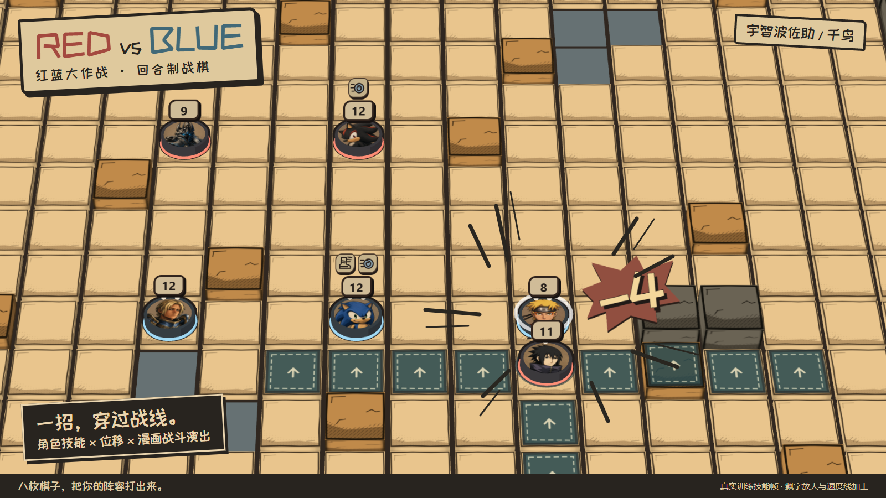
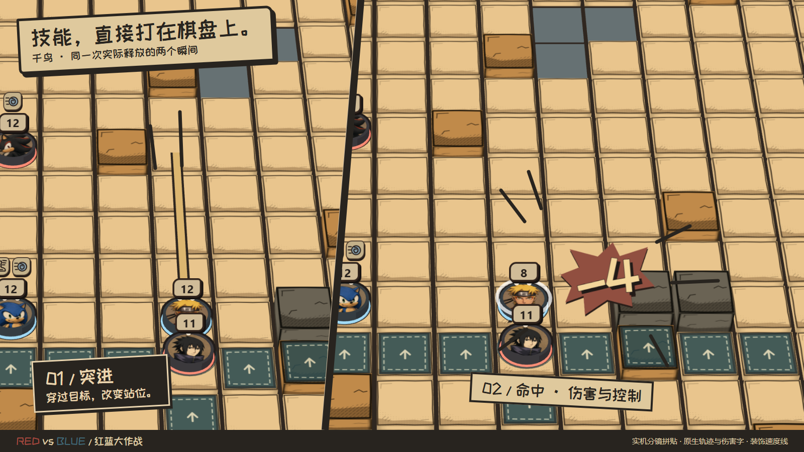
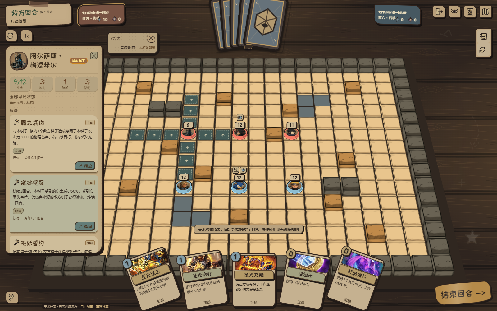
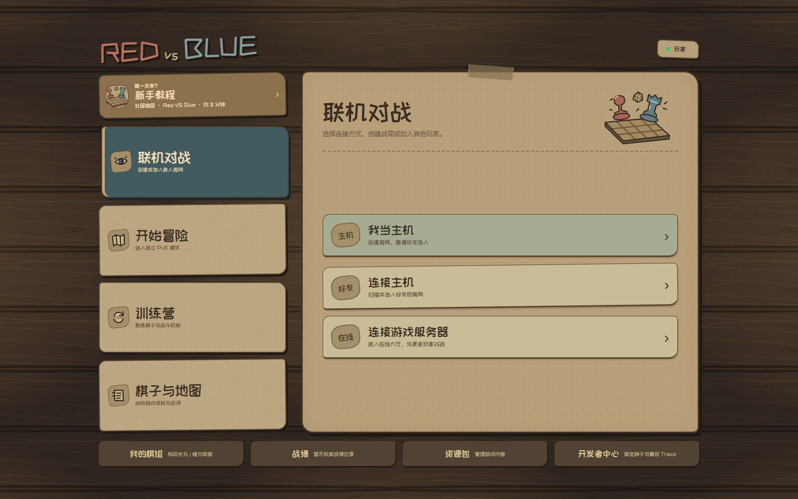

<p align="center">
  
</p>

<h1 align="center">Red VS Blue · 红蓝大作战</h1>

<p align="center"><strong>八枚棋子，一张战场。让阵容、走位与技能连锁决定胜负。</strong></p>
<p align="center">回合制战棋 × 卡牌策略 × 可扩展内容创作</p>
<p align="center">
  <a href="#游戏是什么">认识游戏</a> ·
  <a href="#快速开始">本地开发</a> ·
  <a href="#代码地图">代码地图</a> ·
  <a href="#参与开发">参与开发</a> ·
  <a href="docs/README.md">文档中心</a>
</p>

## 游戏是什么

Red VS Blue 是一款正在开发中的桌游风格策略游戏。你从同一内容阵营中选择 **8 枚不同核心棋子**，逐回合将阵容部署到战场，在有限行动点内安排移动、技能与卡牌，争夺位置和出手机会。

胜负围绕**场上存活的核心棋子**展开：即使预备区还有角色，场上核心被清空也会败北。保住先锋、选择增援时机、打断对方连锁，每一步都会影响下一回合。

- **阵容会产生化学反应。** 角色拥有不同的技能、状态与专属机制，尝试让控制、位移、输出和支援相互配合。
- **地形也是战术的一部分。** 在不同地图中利用墙体、掩体与路径，重新判断技能范围、弹道和站位。
- **桌游的手感，电子游戏的结算。** 木桌、纸张与角色卡面承载战棋操作；技能效果、状态和行动历史帮助理解战局。
- **也可以走到规则背后。** 项目包含独立内容编辑器、技能流程图和数据驱动的角色、卡牌、地图与规则系统。

规则细则见 [核心循环](docs/product/CORE_LOOP.md) 与 [基础规则词典](docs/product/RULE_DICTIONARY.md)。

## 看看游戏



*介绍图取自训练场中一次实际释放的「千鸟」：突进、命中与伤害飘字。保留现有角色和棋盘美术，放大原生伤害字，并添加漫画速度线；固定摆位用于展示。*

<details>
<summary>查看未经拼贴的完整实机界面</summary>





</details>

截图来源、原图与可编辑排版见 [媒体说明](docs/media/README.md)。

## 当前能做什么

项目处于 **Demo 开发与重构阶段**，主要开发目标是 **Windows 10/11 x64 的 Electron 客户端**。

| 方向 | 当前状态 |
| --- | --- |
| 回合制对战 | 角色构筑、渐进部署、地图、技能/卡牌、状态与终局结算 |
| 联机与战报 | 基于 Colyseus 的房间与对局，PostgreSQL 持久化、重连与可验证战报 |
| 学习与练习 | 分课教程、自由训练、PVP 人机练习；教程第六课暂未开放 |
| PVE | 独立冒险流程与内容系统，持续建设中 |
| 内容创作 | 独立 Electron 编辑器；角色、技能、卡牌、规则、贴图与技能流程图 |
| AI 与调试 | 无窗口规则执行、自对弈、回放和开发者调试工具 |

仓库中的 Android 和其他平台打包配置保留用于相关开发；这里的运行说明以 Windows 为准。以上能力不等于正式发行承诺，具体限制见对应 [技术文档](docs/technical/README.md)。

## 快速开始

### 环境与安装

准备 Windows 10/11 x64、Git、Node.js **22 或更高版本**及 npm。依赖版本由 `package-lock.json` 固定；本次文档验证使用 Node.js 24.13.1。

```powershell
git clone https://github.com/longaadream/Red_VS_Blue.git
cd Red_VS_Blue
npm.cmd ci --legacy-peer-deps
```

当前依赖树中 Colyseus 的可选 Zod 4 peer 与项目 Zod 3 存在冲突，普通 `npm ci` 可能报 `ERESOLVE`。上面的兼容选项用于安装现有锁定依赖，不会升级依赖；该兼容问题仍待专项处理。

### 启动桌面游戏

首次运行先构建网页资源，再启动 Electron：

```powershell
npm.cmd run build
npm.cmd run dev:electron:client
```

客户端开发入口会构建本地对局服务、准备应用私有的 PostgreSQL，并打开游戏主菜单。第一次运行可能需要下载运行组件。修改网页或静态资源后重新构建；不同 worktree 应各自安装依赖、生成构建产物。

### 启动内容编辑器

```powershell
npm.cmd run dev:electron:editor
```

从 [人类与 AI 内容协作](docs/technical/HUMAN_AI_CONTENT_WORKFLOW.md) 开始，了解项目、校验、版本和发布内容的流程。编写技能前阅读 [SkillCode 作者手册](docs/technical/SKILLCODE_AUTHORING_STANDARD.md)；当前运行时仅接受受信任内容。

<details>
<summary><strong>其他常用命令：网页、服务端、检查与打包</strong></summary>

| 命令 | 用途 |
| --- | --- |
| `npm.cmd run dev` | Next.js 页面/API 开发；完整游戏以 Electron 入口为准 |
| `npm.cmd run dev:colyseus` | 单独开发对局服务，先配置 `RVB_POSTGRES_URL` |
| `npm.cmd run typecheck` | 生成 Next 类型并执行 TypeScript 检查 |
| `npm.cmd run lint` | ESLint 检查 |
| `npm.cmd test` | Vitest 测试 |
| `npm.cmd run check:encoding` | 文本编码检查 |
| `npm.cmd run test:colyseus` | 房间与联机相关测试 |
| `npm.cmd run test:postgres` | PostgreSQL 集成测试，需独立测试库 `RVB_TEST_POSTGRES_URL` |
| `npm.cmd run build:electron:client` | 构建 Windows 客户端候选，输出到 `dist/client-build/` |
| `npm.cmd run build:electron:editor` | 构建内容编辑器候选 |

未配置测试数据库时，相关测试会跳过。完整环境、服务端设置和冒烟步骤见 [构建与运行](docs/technical/BUILD_AND_RUN.md)。

</details>

## 代码地图

**TypeScript · Electron · Next.js / React · Colyseus · PostgreSQL · Vitest**

玩家界面提交动作意图，房间协调层交给规则引擎结算，再把对应玩家可见的状态发回界面。对局持久化和回放由服务端维护；表现层与核心规则保持独立。

| 路径 | 从这里了解什么 |
| --- | --- |
| [`data/pages/`](data/pages/) | 实际游戏页面、桌游美术、交互和表现层脚本 |
| [`lib/game/`](lib/game/) | 回合、部署、技能、事件链、AI 与确定性战斗运行器 |
| [`lib/server/`](lib/server/) | Colyseus 房间、PostgreSQL 持久化及服务端接口 |
| [`data/`](data/) | 棋子、卡牌、技能、规则、地图和 PVE 内容 |
| [`lib/content-pipeline/`](lib/content-pipeline/) | 内容校验、Profile、资源与版本流程 |
| [`electron-client/`](electron-client/) / [`electron-editor/`](electron-editor/) | 游戏客户端与内容编辑器 |
| [`app/`](app/) / [`components/`](components/) | Next.js 页面、API 与 React 组件 |
| [`tests/`](tests/) / [`scripts/`](scripts/) | 自动验证、构建、开发和 QA 工具 |

深入阅读：[架构](docs/technical/ARCHITECTURE.md) · [游戏逻辑与执行流程](docs/technical/GAME_LOGIC_SYSTEM.md) · [技能流程图](docs/technical/SKILL_GRAPH_V1.md) · [AI 自对弈](docs/technical/AI_SELF_PLAY.md)

## 参与开发

欢迎围绕可复现的问题、交互体验、角色机制和内容工具提出反馈。提交 Bug 时请附上版本或提交号、复现步骤、预期与实际结果，以及相关截图或战报。

1. 阅读 [开发规则](AGENTS.md) 和 [协作指南](docs/COLLABORATION_GUIDE.md)，先明确任务目标与验收标准。
2. 刷新 `origin/main`，使用包含任务编号的独立分支；运行 `npm.cmd run check:main-baseline`。
3. 修改最小必要范围，执行对应检查，并同步更新文档；提交 PR 时附上验证结果与界面证据。

反馈入口：[GitHub Issues](https://github.com/longaadream/Red_VS_Blue/issues)。项目中的角色及部分美术素材涉及第三方作品；仓库尚未提供统一 LICENSE，使用代码或素材前请与项目维护者确认授权范围。
