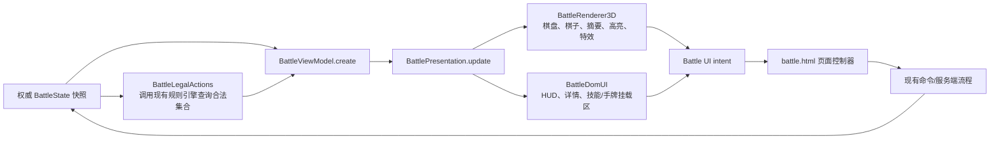

# ADR-0004：战场 Three.js 与 DOM 表现边界

## 状态

提议中（随 RED-48 实现，等待 PR 审查接受）。

## 日期

2026-08-15

## 背景

`battle.html` 是训练、真实对战和观战的唯一战斗入口。RED-48 之前，页面同时把权威状态拼成 HUD、计算移动与技能高亮、直接调用 Three.js，并让 renderer 接收完整 `BattleState`。这使训练与联机模式可能产生不同坐标、生命或目标展示，也让重复进入、resize 和退出的资源所有权不清晰。

本决策只划分表现职责，不改变回合、移动、伤害、技能、卡牌、部署或胜负规则。

## 决策

采用单向展示模型与显式意图接口：



- `BattleViewModel.create()` 是训练、LAN 和 relay 共用的唯一表现投影；来源模式不是展示模型字段。
- `BattleLegalActions` 不实现距离、范围、伤害或结算公式，只用克隆快照调用现有 `GameEngine` 验证入口并返回合法格集合。
- `BattlePresentation` 把同一个展示模型对象交给 Three.js 与 DOM，并拥有 mount、resize、dispose 和用户意图出口。
- `BattleRenderer3D` 只接收最小展示模型，生命周期固定为 `init → update/resize/project → dispose`，不接收或修改全量 `BattleState`。
- `BattleDomUI` 负责 HUD 与选中棋子摘要；`battle.html` 保留网络、训练 fixture、动作提交和仍待后续拆分的 DOM 控制器代码。
- 所有棋盘、棋子和技能点击先发出 `select-piece`、`clear-selection`、`select-skill`、`activate-cell`、`inspect-piece`、`cancel-target` 等意图，再由页面控制器接入原有流程；服务端/规则层仍是非法操作的最终拒绝者。

关键接口：

```js
const model = BattleViewModel.create({
  snapshot,
  viewerId,
  selectedPieceId,
  interactionMode: 'move',
  legal: { moveCells, targetCells, placementCells },
})

presentation.mount({ boardContainer, floatLayer })
presentation.update(model)
presentation.dispatch({ type: 'select-skill', skillId })
presentation.resize()
presentation.resetView()
presentation.dispose()
```

## 备选方案

- 继续由 `battle.html` 分别更新 Three.js 和 DOM：不采用；两层会继续形成不同投影路径。
- 让 Three.js 直接读取全量 `BattleState`：不采用；renderer 会知道规则层字段并逐步复制规则。
- 在本任务新增全局状态库：不采用；超出合同且会制造新的权威状态来源。
- 同时重构服务端合法目标协议：不采用；这属于 RED-59，本任务只适配现有规则查询入口。

## 影响

- 收益：训练和真实/relay 使用同一展示模型；renderer 生命周期和坐标接口可测试；后续 RED-49、RED-50、RED-51 有稳定挂载点。
- 成本：在服务端提供版本化合法目标查询前，合法集合适配器需要在克隆快照上逐格调用现有规则验证入口。
- 风险：大地图目标查询可能有性能成本；本任务通过只在选择/目标模式查询并保留服务端最终校验来控制风险。

## 验证方式

- 展示模型来源一致性测试。
- presentation 重复 mount/dispose 和同对象双层输入测试。
- resize、详情栏切换与 DPR 变化后，`projectCell()` / `screenToCell()` 必须保持同一格子；镜头复位通过 presentation 生命周期转发，不进入规则命令。
- renderer 脚本语法、初始化/resize/投影/dispose 浏览器回放。
- 1280×720 与 390×844 的格子投影/命中和选择/取消/目标模式冒烟。
- 浏览器截图与 console 检查记录在 `output/playwright/red-48-browser-evidence.md`。
- Medium Risk 独立 AI 架构审查。

## 回退方式

回退 RED-48 的 UI 分层提交，恢复 RED-47 后的统一 `battle.html` 页面；不得恢复独立训练页面或改变规则、数据、依赖和存档。

## 相关资料

- Linear：RED-48、RED-47、RED-59
- `docs/technical/ARCHITECTURE.md`
- `docs/technical/MODULE_INTERFACES.md`
- `tests/game/battle-ui-boundary.test.ts`
- `output/playwright/red-48-browser-evidence.md`
