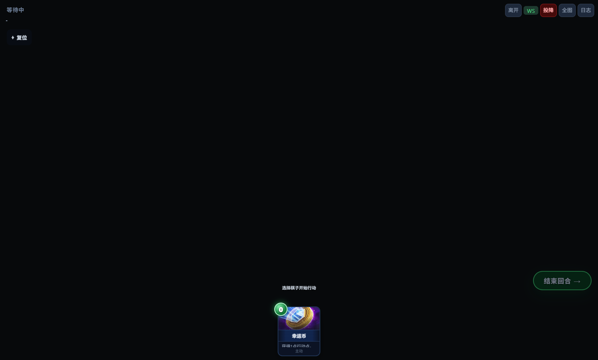
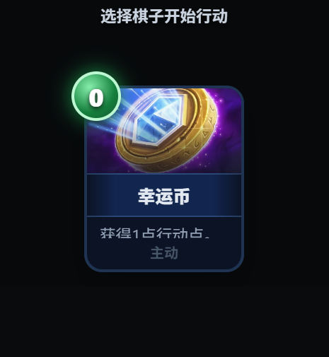

# RED-105 LAN 手牌卡牌元数据验证

## 验证目标

当 LAN 权威手牌只包含 `{ cardId: "lucky-coin", instanceId: ... }`，且客户端本地 `cardsById` 为空时，战斗页应只为当前手牌中的稳定 `cardId` 请求展示元数据，并显示：

- 名称：幸运币
- 描述：获得1点行动点。
- 费用：0
- 类型：主动
- 本地图：`images/card-art/the-coin.jpg`

元数据恢复不得发送 `playCard`、创建 `pendingCardAction`、修改 AP/手牌/BattleState，或保留服务端返回的 `code` 字段。

## 根因与修复边界

LAN 快照按设计只传稳定卡牌实例字段。原页面只从本地 `data/cards/**` 填充 `cardsById`；棋子为空时有服务端兜底，但卡牌为空时没有。`renderHand()` 因此直接执行稳定 ID/占位描述/占位图片降级，而且后续没有恢复机会。

修复保留该安全降级，并新增：

- local-first：训练/离线模式和正常 LAN 首选本地卡牌定义；
- authority-fallback：仅 LAN 当前手牌缺失的稳定 `cardId` 请求现有 `/api/cards/[cardId]`；
- 展示投影：只缓存 `id/name/description/actionPointCost/type/image/cooldownTurns`，不缓存或执行 `code`；
- 安全卡图：只接受 `images/card-art/**` 下的 jpg/jpeg/png/webp 相对标识；
- 单请求缓存：同 ID 多实例、重复渲染和后续快照复用缓存；失败负缓存避免无界重试；
- 生命周期：快照已移除该卡时不重绘，页面 dispose 后的迟到响应不落缓存、不重绘；
- 诊断：失败日志包含稳定 `cardId`，单张失败不阻止其他手牌恢复。

## 自动验证

### 修复前失败基线

`npm test -- tests/game/battle-card-metadata-runtime.test.ts`

- 6/6 场景因页面缺少卡牌展示恢复函数而失败。

### 修复后

- 聚焦回归：`8 passed`。
- 受影响测试：`6 files passed, 74 tests passed`。
- 完整 Vitest：`87 files passed, 695 tests passed`。
- `npm run typecheck`：通过；命令自动改写的范围外 `next-env.d.ts` 已恢复。
- `npm run check:encoding`：通过（当次 604 个文本文件；最终检查另行记录）。
- `node --check tests/electron/windows-client-development-smoke.mjs`：通过。
- `npx tsc -p electron-client/tsconfig.json`：通过。
- `git diff --check`：通过。
- `npm run lint`：未进入源码扫描；现有 ESLint 配置加载时报错：规则 `import/no-anonymous-default-export` 所在配置对象未注册 `import` plugin。本任务未修改依赖或 lint 配置。

Vitest 覆盖本地成功、真实 LAN fallback 逻辑、同 ID 多实例/在途去重、成功缓存、404、超时、失败负缓存、单卡失败不阻塞其他卡、非法图片、快照切换、页面 dispose 迟到响应和零动作提交。

## Windows Electron / LAN 证据

执行：

1. `npx tsc -p electron-client/tsconfig.json`
2. `npm run dev -- --webpack`
3. 预热 `GET http://127.0.0.1:3000/api/cards/lucky-coin`（Next 开发模式首次按需编译超过 3500ms 时会按设计超时并负缓存；候选包为预编译产物）。
4. 设置 `RVB_RED105_AUTHORITY_URL=http://127.0.0.1:3000` 和截图路径后运行 `node tests/electron/windows-client-development-smoke.mjs`。

最终 live authority 结果：

```json
{
  "requestCount": 1,
  "requests": [{ "path": "/api/cards/lucky-coin", "timeoutMs": 3500 }],
  "authorityMode": "live",
  "cardName": "幸运币",
  "description": "获得1点行动点。",
  "cost": "0",
  "typeLabel": "主动",
  "imageSource": "images/card-art/the-coin.jpg",
  "imageLoaded": true,
  "pendingCardAction": null,
  "actionMessages": [],
  "stateUnchanged": true,
  "fallbackKeys": ["actionPointCost", "description", "id", "image", "name", "type"]
}
```

服务端日志确认 Electron fallback 请求返回 `GET /api/cards/lucky-coin 200`。同一冒烟还确认开发版自定义协议直接读取 `data/cards/lucky-coin.json` 和 `images/card-art/the-coin.jpg` 均为 200。

完整首帧：



手牌细节：



该 Electron 证据使用最小权威状态 fixture 注入仅含稳定实例字段的后手手牌，并真实请求本机 LAN/Next 单卡接口；它不创建房间或执行出牌。完整双客户端建房/加入体验仍建议人工复核。

## 包与回退证据

当前 `electron-builder.client.json` 已把 `data/cards/**` 和 `public/card-art/**` 复制到 `resources/app/www`；`verify-electron-client-package.js` 会逐文件和 SHA-256 校验离线数据与图片。完整 Vitest 包含该包验证器测试。本次没有重新生成完整 Windows 候选包；合同允许的替代证据由真实 Electron custom protocol 资源 200 与 live authority fallback 成功共同提供。

## 建议人工复核

1. 启动 Windows 服务端和两个隔离 Electron 客户端。
2. 两端加入同一房间并开始战斗。
3. 在后手首帧、不点击卡牌的情况下确认幸运币名称、描述、0 费、主动类型和卡图。
4. DevTools Network 中确认 `/api/cards/lucky-coin` 至多一次（本地定义成功时应为 0 次）。
5. 确认没有 `playCard` 消息、pending 提示、AP/手牌/弃牌变化。

## 回退

整体回退 `battle.html` 的展示元数据 loader/cache、安全卡图解析、相关测试和本证据文档即可。回退后恢复原 ID/占位降级，不涉及存档、数据库、规则、数值或迁移。
