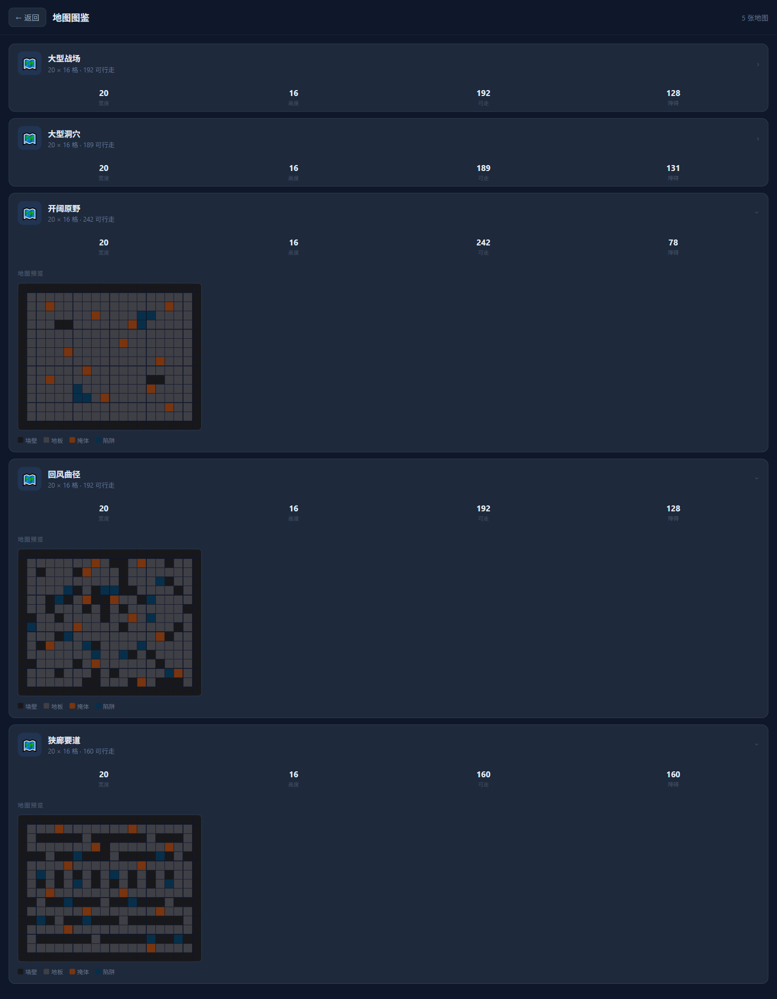
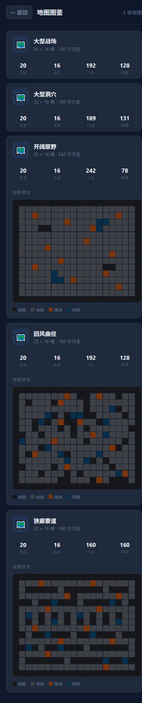

# RED-112 地图多样性验证

验证日期：2026-08-27

分支：`codex/red-112-map-diversity`

基线：`origin/main@81c754f247b4f627741fbb953df820fdd82ffee2`

风险：Medium

## 结果摘要

新增地图目录由 2 张扩展为 5 张。三张新地图均为 20×16，只使用地板、墙、掩体和洞穴；没有熔岩、充能台、治愈泉或对应回合数值。三张地图只进入图鉴、调试和后续内容基线，Demo v0.1 正式房间仍固定 `large-hole-arena`。

| 地图 | 普通地板 | 可走格 | 可走比例 | 关键空间指标 |
| --- | ---: | ---: | ---: | --- |
| 开阔原野 `open-expanse` | 230 | 242 | 75.6% | 最长连续可走直线 18；图割点 0 |
| 回风曲径 `winding-pass` | 180 | 192 | 60.0% | 最长连续可走直线 10；转角格不少于 12 |
| 狭廊要道 `narrow-corridors` | 148 | 160 | 50.0% | 122/160 可走格度数 ≤2；图割点 12 |

三图全部四向单连通；左右、上下半区可走格数量分别完全相等，但逐格布局不满足 180°、水平轴或垂直轴精确镜像。可走比例严格满足“空旷 > 弯绕 > 狭窄”。

## 自动验证

| 命令 | 结果 |
| --- | --- |
| `npm.cmd run check:main-baseline` | 通过；分支基线与 `origin/main` 一致，ahead/behind 均为 0 |
| `npm.cmd test -- tests/game/map-catalog.test.ts` | 通过；1 个文件、8 个测试 |
| `npm.cmd run typecheck` | 通过 |
| `npm.cmd test -- tests/game/deployment.test.ts tests/game/spatial.test.ts tests/game/movement-contract.test.ts` | 通过；3 个文件、32 个测试 |
| `npm.cmd run check:encoding` | 通过；629 个文本文件 |
| `npm.cmd test` | 通过；102 个文件、796 个测试 |

独立 AI 审查最终结论为“通过”，AC-01～AC-08 无阻塞项。审查早期发现大厅异步加载可能短暂提交旧 `arena-8x6`，以及目录测试可被非布尔值、重复 legend 或替代字符绕过；实现已将初始选项与创建请求都固定为 `large-hole-arena`，并把测试加固为严格布尔、逐 legend/解析 tile 语义、解析后语义网格和完整 JSON 禁用 token 检查。独立复核与最终完整回归均通过。

附加执行 `npm.cmd run lint` 时，仓库现有 ESLint 配置引用了未注册的 `import/no-anonymous-default-export` 插件，因此在分析文件前终止。RED-112 不修改依赖或全局 lint 配置；该工具链问题不计为任务测试通过，也不影响上述合同门禁结果。

目录测试还验证：

- 两张既有地图 SHA-256 保持不变；manifest 与实际 5 个 JSON 文件严格一致。
- 每张新地图均解析为 320 个唯一坐标，普通 floor 至少 64 格，全部 walkable 四向连通。
- 只允许 `floor`、`wall`、`cover`、`hole`；禁止 `lava`、`spring`、`chargepad` 以及三个回合效果字段。
- 地图仓库与服务端 JSON 加载路径都能发现 5 张地图。
- 大厅地图选择器仍只加载并提交 `large-hole-arena`。

## 浏览器证据

入口：`http://127.0.0.1:4176/qa/client/maps.html`。使用真实 Chromium 展开三张新增卡片并验证：

- 桌面视口 1440×1000：5 张卡片均呈现；三张新增预览的开放度、弯折密度和狭窄通道明显不同。
- 移动视口 390×844：卡片、四项统计、20×16 预览和图例均未截断或横向溢出。
- 页面查找“熔岩”“充能台”“治愈泉”均返回 0 个匹配。
- 唯一控制台错误是与本任务无关的 `/favicon.ico` 404；地图 manifest 和 5 个 JSON 请求均返回 200。

## 人工复核建议

1. 打开地图图鉴，依次展开“开阔原野”“回风曲径”“狭廊要道”。
2. 观察开阔图是否提供大片连续空间，弯绕图是否迫使多次改变路线，狭窄图是否形成一至两格宽的通道和瓶颈。
3. 确认图例只有墙壁、地板、掩体、陷阱。
4. 打开 1v1 大厅，确认创建房间仍只显示“大型洞穴”。

## 已知边界与回退

本任务不把三张新地图接入正式 PVP，也不修改部署、移动、弹道或地形结算。若需回退，回退 RED-112 独立提交即可删除三张 JSON、manifest 条目、目录测试、QA 文档/截图，并恢复大厅原有加载逻辑；无需数据迁移。
