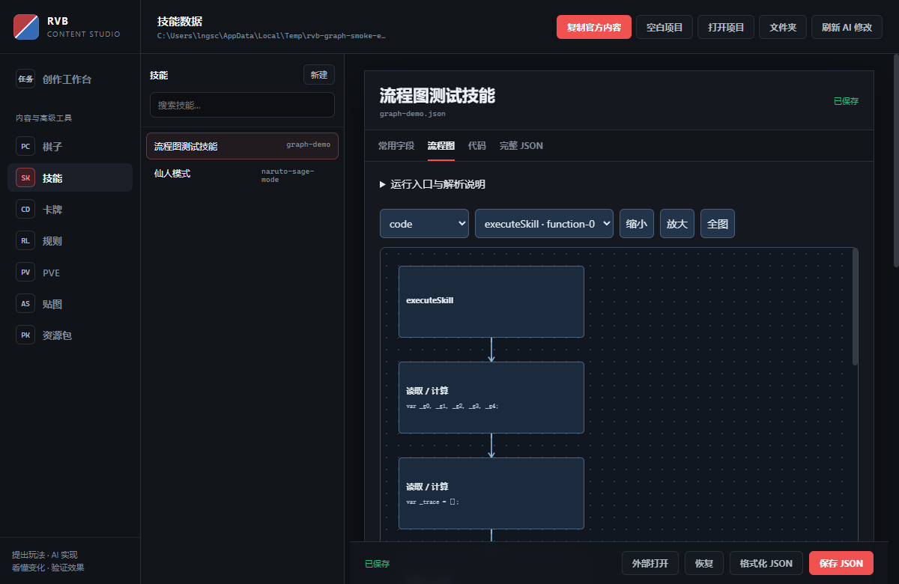

# RED-192 描述标准与技能图候选验证

风险 High，供人工验收，未合并或发布。任务为 RED-192。基线 main：`e9b6918080010f30f5b2fe5f535548f80c90a257`，集成提交 `464b50c2dbd629378a9da2219d390190bb73939b`，包含 PR161 的 `5a8bf3669dbd764c0e15370d76b5f22ec74bbb95` 与 PR162 的 `19f9e568e315fb375d23cc566df35fd74e42f56f`。依赖两项 PR 的基础能力。

## 交付与设计确认

- 率先出阵使用共享技能元数据，鸣人移除专属优先部署标志；描述为“当阵容中有本棋子时，本棋子首先上场。”多个持有者依既有种子规则只选一名，其他棋子复用有回归测试。
- 审核144技能（包含辅助与遗留项），修改133项正文、预览或目标提示。前后对照见[完整清单](../RED-192-skill-language-audit.json)。语言迁移不修改执行代码；独立机制变更仅为用户确认的暴风雪冰冻1、飞行第二个后续己方结束落地。柱间自愈保留2，重拳保留现有首个阻挡与250%行为。
- 图编译器、浏览器画布与宿主保存验证共享一份生成规则；使用现有引擎和原子保存。准确支持范围见[手册](../../technical/SKILL_GRAPH_V1.md)，未实现任意脚本反向导图、跨回合事件节点和战斗逐步播放。
- 集成类型修复仅把两侧 SVG 解析器的 dotAll 正则等价改写为 ES6 兼容形式，不放宽 SVG 策略。

## 自动验证

初次 game + electron 扩大测试：1442项，1411通过、31失败。按用户已确认的语言和计时变更同步旧的普通断言；没有重录冻结状态 hash。定向313项复查初次310通过，剩余两项文案提示断言修正后相关39项全部通过；另一项为原有动能说明断言。两项AI用例超时与一次资源包并发写入错误，串行/60秒预算复查47项全部通过。

最终扩大测试命令为 `npm.cmd test -- tests/game tests/electron --maxWorkers=1 --testTimeout=60000`：1442项，1431通过、11失败。其后修正混沌之矛断言中的“下1个/下一个”拼写，Sonic定向41项中40通过，仅原有动能词条失败；最后炎灵“失去生命”文案按原代码改为“受到真实伤害”，完整144项文案与计时校验3项通过。未重新运行整个1442项套件冒充最后一次全绿；剩余10项如下。每轮机器摘要见 [checks.json](checks.json)。

| 剩余项 | 分类与依据 |
| --- | --- |
| AI语义审计1项 | 原有8条准入诊断，与前序RED-192基线报告一致 |
| 静态审计2项 | 原有triggerSkill数量21/19、skill数量134/144断言 |
| 动能词条1项 | 原有“累积/积累”措辞断言，词条文件本轮未改 |
| 目标集合hash 1项 | 原有fc1fe4dd/efb69827差异，未重录冻结值 |
| 战斗页脚本测试3项 | VM夹具缺少TUTORIAL_MODE/tutorialActionAllowed，相关测试与页面相对origin/main无差异 |
| 内嵌PostgreSQL 2项 | 当前工作区未准备数据库运行库/manifest；相关测试相对origin/main无差异 |

前五项的独立原基线复现证据见[规则词典QA](../RED-192-rule-dictionary.md)。本PR不宣称全仓库门禁通过。

根 typecheck 通过；Electron TypeScript 通过；新增编译器、宿主和相关回归测试的定向 ESLint 通过；编码检查963文件通过；引擎由源码重建，Node/桌面/Android固定Unicode hash用例通过；main-baseline Behind 0。

核心运行器用例覆盖：过量伤害只吸取实际扣血、圣盾抵挡零吸血、友方两步传送、禁锢目标排除及伪造命令拒绝、放弃准备不改变状态、重复提交拒绝、状态双来源独立撤销、条件分支、同种子确定性。飞行用例实际推进结束/换人/开始阶段，验证施放当回合不扣时长、下一己方结束仍飞行、第二个结束落地，同时保留无关免疫。

## 真正的候选应用

使用本机已有 Electron 43.4.0 生成 Windows 目录、portable 和 NSIS 候选（仅本地构建，未安装/发布）。包完整性检查通过：657数据、39脚本、165运行时资源。因源码无 public/images，该可选复制源由 builder 提示缺失；数据包与脚本完整性检查通过。

在构建出的 `dist/editor/win-unpacked/RED vs BLUE Editor.exe` 上运行 `tests/electron/skill-graph-smoke.mjs`，使用独立临时项目与隐藏窗口：真实创建节点、设置10点真伤和50%吸血、连接流程；制造循环并验证不能保存；切换代码/JSON；保存、重开且扩展字段保留；制造外部版本冲突并验证原文件未覆盖。结果见 [smoke.json](smoke.json)。



复验命令（PowerShell，在仓库根）：

```powershell
npm.cmd run build:electron:editor
$env:RVB_GRAPH_EDITOR_EXE = Join-Path (Get-Location) 'dist/editor/win-unpacked/RED vs BLUE Editor.exe'
node tests/electron/skill-graph-smoke.mjs
```

本次缓存依赖缺少默认 Electron 二进制，因此构建时通过 `--config.electronDist` 指向本机已存在的43.4.0分发，不更改项目依赖。目录模式不产生portable/installer时完整性检查会拒绝，已补建二者后通过。

## 独立审查

由独立 AI 只读审查编译器、目标准备/真实结算、状态来源及144项文案。发现并修复：状态缺少施法者来源；必然传送路径未提前排除禁锢目标；诅咒描述中的玩家代词；重拳和暴风雪动态预览旧文案。最后复审无阻塞发现。审查者还实测条件传送：不进入传送分支可正常结算，进入非法传送分支则整个操作拒绝且输入 hash 不变。

## 人工体验与回退

建议先在临时项目创建“真伤后吸血”和“友方传送”两种图，审核自动描述、连线体验与保存重开；再实战核对鸣人优先上场、飞行计时和暴风雪1回合。此处的自动结果不能代替人工体验验收。

回退按语言/共享部署与图编辑两个实现提交分别撤销；项目需先备份。图技能可在新编辑器明确解除图关联保留代码后回到旧作者模式。规则v2对局不能无损降级到v1，详见PR161验证文档。
