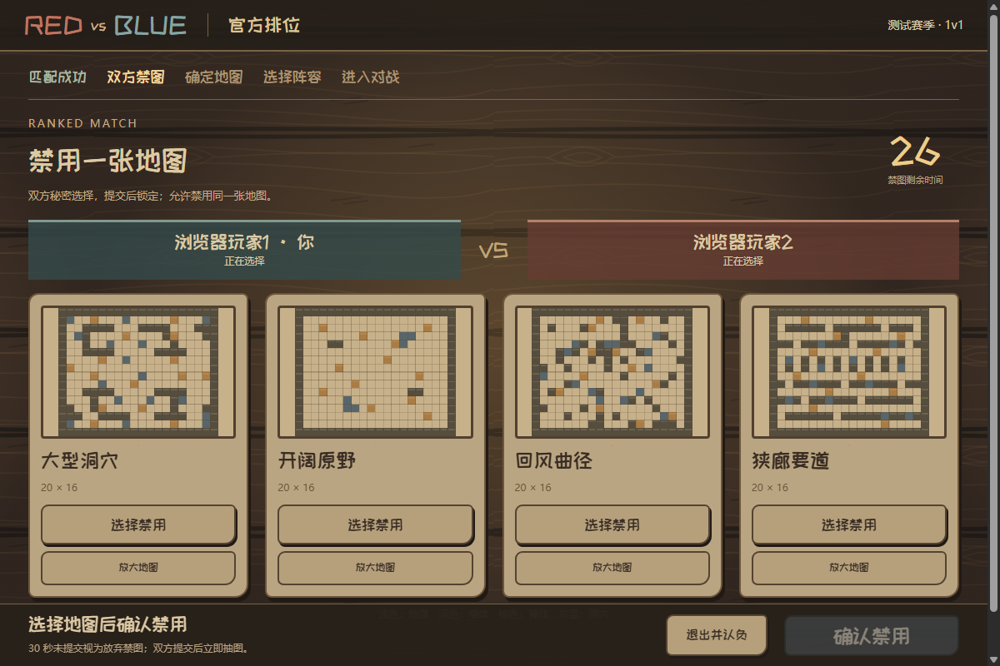
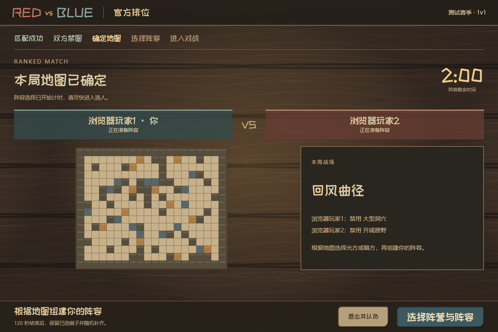
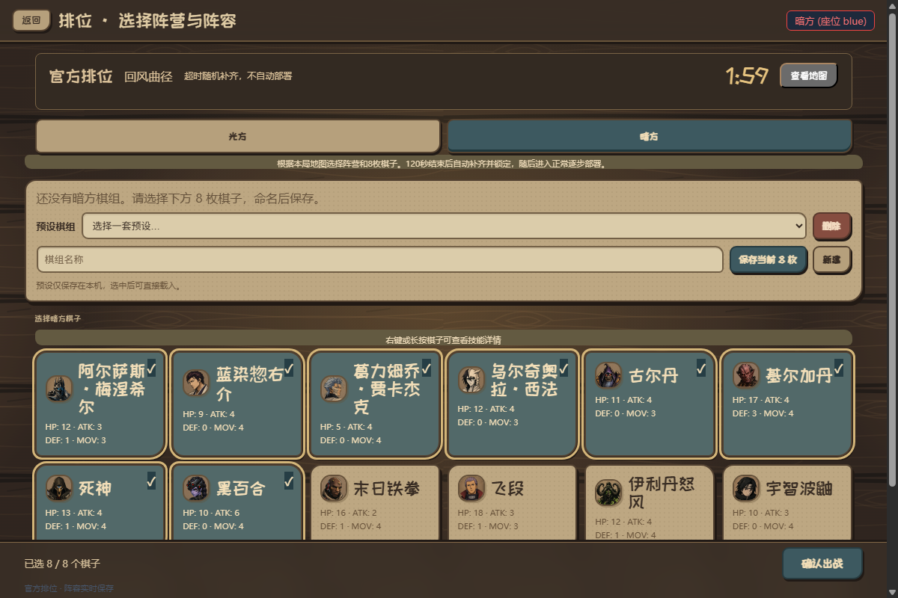
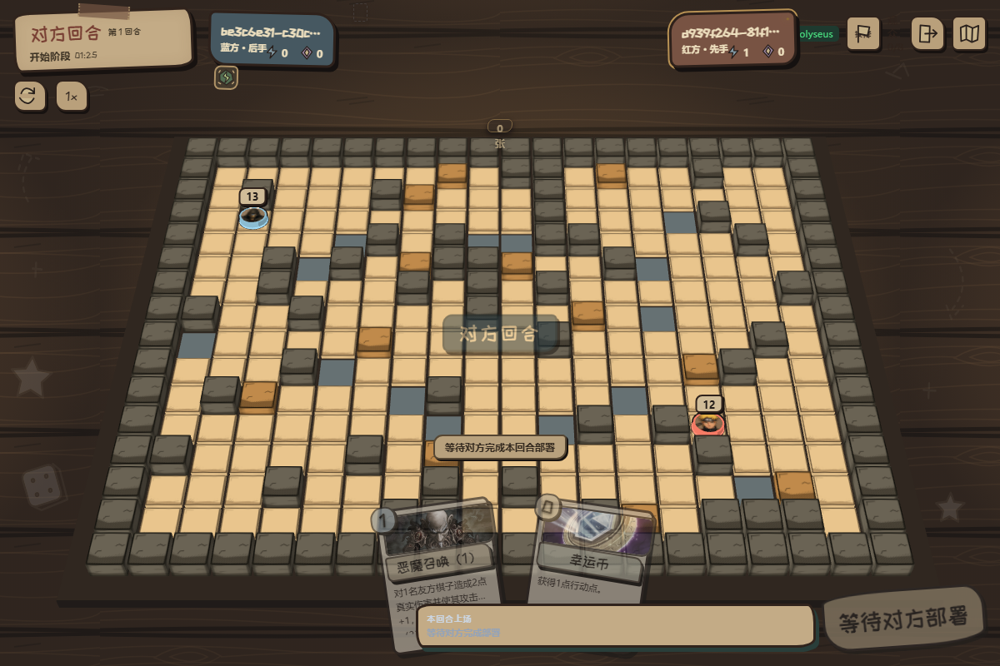

# RED-196 实际排位流程证据

2026-09-09，本机隔离PostgreSQL与Colyseus服务，Chrome两个独立测试账号。没有发送真实邮件，也没有读取或修改用户运行库。

完整操作：邮箱登录→系统匹配→30秒秘密禁图→剩余地图抽取→120秒原版选人→查看地图并恢复8枚草稿→渐进部署→实际认输→1016/984 Elo及历史。

验证：4项赛前规则、6项实际PG管理、14项官方PG/Colyseus回归，及普通对局/观战/客户端4文件26项通过。额外定向检查初始对局已落盘但赛前starting尚未确认时重启，保留原随机种子、地图、阵容和单一权威房间。类型、全量lint、编码通过。

源码完整流程通过；当前源码尚未生成新分发候选，之前RC4候选不包含多地图赛前增量。安卓、公网HTTPS、真实邮件送达及地图竞技胜率仍需后续验证。历史候选证据见[QA记录](../../technical/RED-196-QA.md)。
