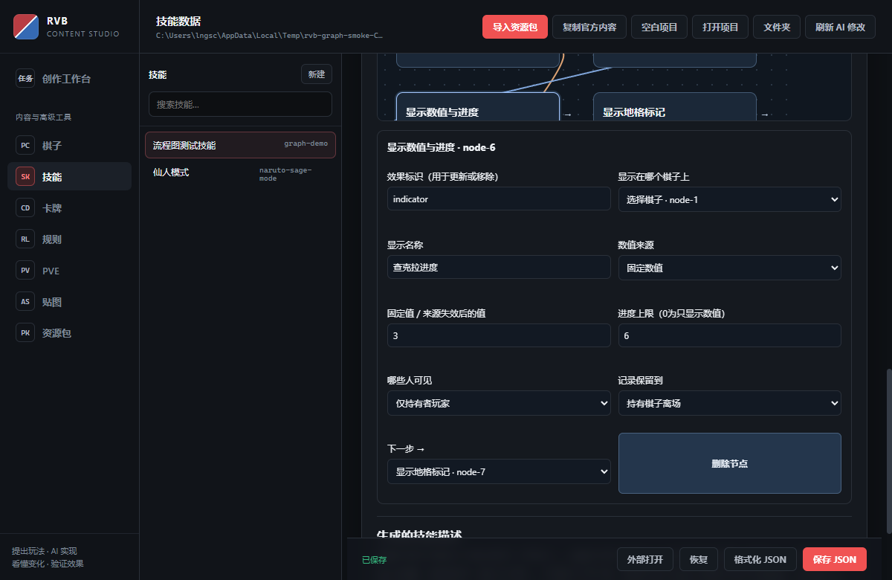

# RED-202 候选验证

基线：`main` / `895834297e3e49ebbf10b12074c08979931b6e01`。分支：`codex/RED-202-skill-presentation`。日期：2026-09-10。

## 交付范围

通用表现声明与观看者投影、战斗页消费者、编辑器5个表现节点与2个选项节点、主动多选权威校验、延迟地格多选界面，以及训练 AI 选项组合。API 与边界见 [SKILL_PRESENTATION.md](../../technical/SKILL_PRESENTATION.md)。独立审查结束时无剩余具体阻塞；尚待用户产品验收，没有合并或发布。

## 自动验证

最终相关组合：10 文件、149 用例，147 通过，另2项如下。没有更新失败快照或放宽断言。

```powershell
npx.cmd vitest run tests/game/skill-presentation.test.ts tests/game/skill-presentation-ui.test.ts tests/electron/skill-graph.test.ts tests/game/developer-tools-trace.test.ts tests/game/flow-runtime.test.ts tests/game/pending-interaction.test.ts tests/game/targeting.test.ts tests/game/battle-ui-boundary.test.ts tests/electron/battle-page-runtime.test.ts tests/game/ai-environment.test.ts --maxWorkers=1
```

- `targeting.test.ts` 固定清单哈希失败：expected `efb69827a23519d68ab13bf4887d1f6154eb1838abea36f8aafd1920f097609a`，actual `fc1fe4dd99bf95e4a7b908c158dc2df66f71273d576e50852e8bdb9c24155a66`。在新建、未修改的准确基线工作树运行同文件，结果也是20通过、同一项失败、相同actual，基线 `git status` 干净。
- `ai-environment.test.ts` 的真实部署／待选择集成用例在组合运行超过默认5秒（约6.7秒）。用 `--testTimeout=20000 --maxWorkers=1` 单独执行全文件，23/23通过（全文件约18.6秒）。基线该用例单独执行约3.9秒通过。未修改仓库超时配置，不将这项计为默认时限通过。
- 新接口及编辑器、真实页面选择、UI边界5文件64用例通过。真实页面地格选择结果经过 `validatePendingTargetSubmissions`；新图经 `runBattleAction` 执行，并验证 `listLegalAIActions` 生成合法组合。
- `npx.cmd tsc --noEmit --incremental false --pretty false` 通过；编辑器 tsc 通过。
- `npm.cmd run lint` 全仓零新违规通过；CI使用的 `tests/eslint-config.test.ts` 5/5通过。
- `git diff --check`、`npm.cmd run check:main-baseline` 通过。
- 构建编辑器 worker 时修正既有 Promise 分支类型推导：回调标记 async；不改变导入/构建的业务分支。

覆盖：显示/实际状态分离、实时/快照/来源失效、持有者死亡、有效期、JSON往返、私有声明过滤、隐私域序号独立、真实终局回放不泄露且检查点哈希一致、重复提示与同页恢复去重、非法输入、选项分支、数量/重复项/过期凭证、地格选择与AI。

## 实际 Electron 候选

```powershell
node scripts/build-skill-graph.mjs
npm.cmd run build:content-pipeline:editor-bundle
npx.cmd tsc -p electron-editor/tsconfig.json --pretty false
$env:RVB_PRESENTATION_SMOKE='1'
# 若当前依赖中没有electron.exe，可以指定已有同版本Electron。
$env:RVB_GRAPH_ELECTRON_BINARY='<已有 Electron 的绝对路径>'
node tests/electron/skill-graph-smoke.mjs
```

本机复用 red192-graph/node_modules/electron/dist/electron.exe 启动本分支编译出的 editor/main.js。测试使用独立临时 userData 和内容项目，隐藏窗口，不覆盖用户内容。初次默认路径缺少 Electron 二进制，因此改为上述已有运行时，未重新安装依赖。

操作结果：通过真实编辑器创建11节点、连接单/多选与分支、配置显示绑定/指示器/地格标记/提示音/移除节点、保存、刷新重开、核对中文权限与数值，编译产物一致。图示例 [candidate-skill.json](candidate-skill.json) 是测试技能，不是已发布资源包；导入到独立测试项目后可查看。



证据：`smoke.json`、截图、候选技能。截图已人工查看，中文参数完整可读。战斗页消费者和真实规则执行用自动测试验证；未宣称本次启动了完整联网客户端进行多人现场验收。

## 独立审查和修复

1. 私有写入推动公共序列 → 按所有者/audience独立序列及历史保留。
2. 同页重连补播提示 → 真实断线、恢复入口建立新水位。
3. 终局嵌套回放保留私有声明 → 创建显示检查点时排除声明，再计算哈希；旧不安全回放出站隐藏，不更改既有哈希。
4. 接口允许地格多选但界面只能单击提交 → 补选中/取消、候选更新、确认、权威payload与已选高亮。
5. AI多选技能提交标量导致无候选 → 确定性合法组合，最多256种（覆盖编辑器8选项全部非空组合）。

独立复审为另一 AI 只读代码审查；测试结果由实现者运行，不能代替用户最终验收。

## 人工验收与回退

在独立内容项目中打开技能→流程图→类型化技能图，添加“绑定显示来源”和“显示数值与进度”，保存再重开。训练场景可用本体/分身验证：显示相同、实际血量独立；切换本人/敌方确认私有进度只对本人出现。先部署本分支运行时，再测试新节点生成的技能。

当前不承诺旧分身真实身份在原协议中保密，也没有将全部旧SkillCode迁移成原子图。共享终局回放不重现新表现提示。回退前先撤回引用这些新节点的内容，再回退代码PR；进行中的权威存档不要跨版本降级。
