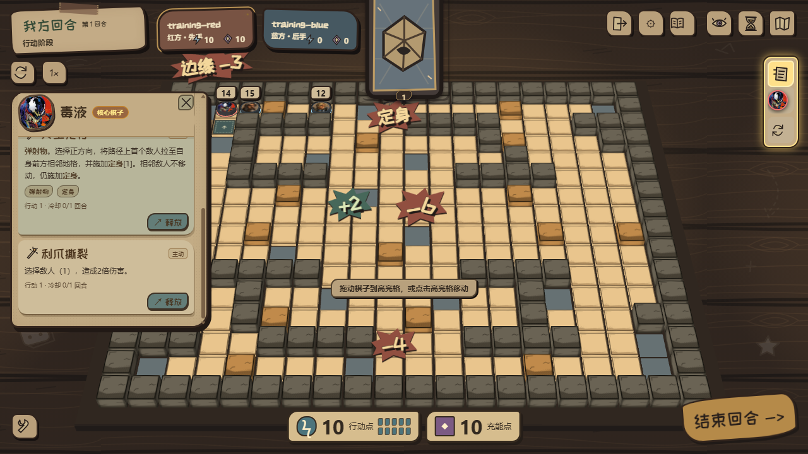
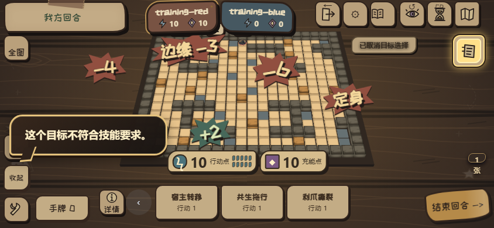

# RED-223 公共浮字堆叠与避让

## 合同与范围

Linear：RED-223。风险 Medium。base_branch: main；base_sha: bc76ce78e9014f50e5ef1ea445895de8979b0ea1，已 fetch origin --prune 并显式刷新 origin/main。依赖 RED-222 提交 616093bd9dda04ecbfe6462dbc218327e313950a（含 RED-221 选择重试）。本任务差异以该依赖提交比较。

仅修改公共浮字布局、CSS、公共 renderer/旧 DOM 接入、两处脚本加载入口、回归测试和文档；没有角色、技能数据、规则、存档、依赖或发布变化。回放页新增 helper 加载已补入合同 allowed_paths。

## 可观察行为

同格最新浮字优先留在锚点附近，旧浮字优先向上排；空间不足时向侧面或下方避让。邻格浮字也纳入同一布局，不合并伤害、治疗或状态文字。布局使用实际宽高，并为原有漫画底形、缩放、旋转、上浮留出空间；正常模式短促移动位置，减少动态模式直接定位。已有提示和技能面板通过公共 data-floater-obstacle 标记避让。

每条浮字仍有独立 2000–3000ms 计时（额外 80ms 清理余量）。自然收尾保留；默认 settle、历史、退出和重新挂载释放占位记录。单条到期不把幸存文字拉回下面。布局和浮字不接收鼠标/触摸，不改变权威结算或选择权限。

## 验证

修改前新增 renderer 回归，三条同格浮字只有一个位置而失败；修改后同格三条分别保留、错位且到期清理。纯布局覆盖向上排列、四个边缘、邻近不同尺寸、HUD、饱和搜索；renderer 覆盖计时、减少动态、自然/默认清理、历史、销毁和重新挂载。

命令：

```powershell
npx.cmd vitest run tests/ui/battle-floater-layout.test.ts tests/ui/battle-renderer-3d-runtime.test.ts tests/ui/battle-25d-mobile.test.ts tests/ui/battle-motion-feedback.test.ts tests/ui/selection-retry.test.ts tests/ui/selection-session-retry.test.ts tests/electron/replay-page.test.ts --maxWorkers=1
npm.cmd run lint
npx.cmd tsc --noEmit
```

7 文件、83 项测试通过；lint 和 tsc 通过。旧 CSS 静态测试仍期待 600ms，和已批准的 RED-222 2000ms 不符，本次将受影响断言同步为 2000ms，无快照更新。Vite 配置兼容提示未导致失败。未运行全仓库测试；RED-222 文档记录的无关 path/result 既有失败未在本任务处理。

真实页面回放：

```powershell
$env:RVB_EVIDENCE_ROOT='C:/Users/lngsc/Documents/Red_VS_Blue/red223/output/RED-223/browser'
$env:RVB_RED221_PORT='38725'
$env:RVB_FLOATER_STACKING='1'
node tests/electron/red221-selection-smoke.cjs
```

回放使用实际公共 spawnFloater 入口注入可观察字效，不改变战斗状态或角色代码。五种场景通过：桌面 1280×720、减少动态桌面、旧 DOM 路径及缩小至 1024×600、手机横屏 844×390、减少动态手机。每次同格三条、邻格一条、边缘一条，在 160/450/1200ms 测量真实动画后矩形：逐条保留、透明度 >0.8、不相互覆盖、不被标记 HUD 遮住、位于浮字层视口内、pointer-events:none；2300ms 全部清理。鼠标/模拟触屏原有非法重试、取消和模拟权威拒绝同时通过。

隐藏 Electron 普通窗口暂停动画帧，初次两次时间取样失败；测试改用条件 offscreen 连续绘制，未改变生产浮字时长或绕过清理。完整结果保存在 output/RED-223/browser/results.json，选取以下截图进入仓库方便审查。





## 风险、人工验证与回退

独立 AI 审查未发现阻断问题；指出的 replay 脚本依赖与 legacy resize 接入遗漏已修复。其余低风险边界保留说明：锚点是生成时的像素位置，resize 保证边界和避让，不随镜头变化重新投影到棋子；HUD 占位仅在新增浮字或 resize 时扫描，存活浮字期间刚出现或变大的 HUD 可能短暂遮住文字。实时追踪不在本任务范围。

候选搜索有界，不限制结果条数；有限视口被大量文字占满时仍可能重叠，保留所有结果并标记 crowded，避免隐藏战斗信息。避让会使旧文字离原锚点更远，密集真实战况下的来源辨识需人工体验。尚未测试实体手机、双客户端联网或大规模长期性能；截图字效位置为公共入口的固定测试输入，不代表对应位置存在受伤棋子。

建议在训练营连续伤害/治疗、多目标技能、边缘棋子、减少动态和调整窗口大小场景验收；确认阅读和文字来源都易辨认。实现者不代替人工体验验收。回退仅本任务提交，保留 RED-222/RED-221；不合并或发布。
