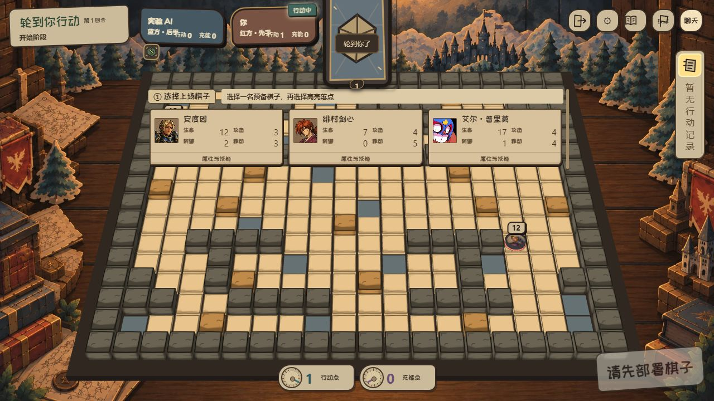
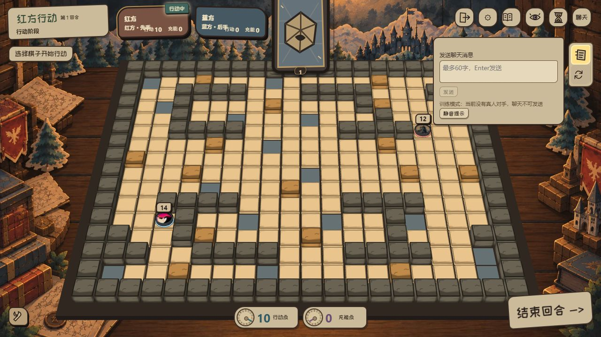
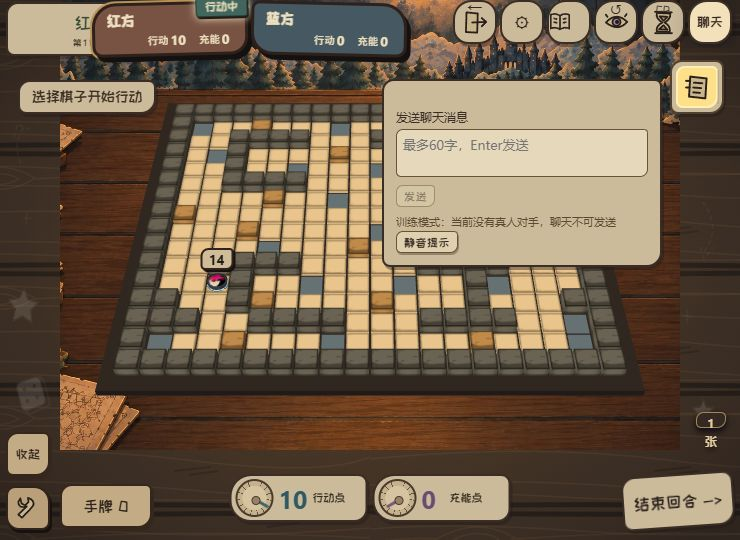

# RED-241 扁平控件修正

2026-10-08，用户确认：背景保留材质，图标与控件扁平化；部署角色签保留。风险 Medium。本轮没有规则、服务器协议或桌面系统改动。

## 修复与复现

- 原聊天入口与角色详情复开按钮都固定左上方，存在相交区域。现在聊天入口置于右上工具条，面板独立定位。
- 训练开局 → 点击阿尔萨斯 → 关闭详情 → 打开聊天 → 点击“角色”：详情正常复开，聊天仍展开。Escape、焦点、IME、销毁和无工具条回退由行为测试覆盖。
- 短屏检查发现旧窄屏 left/bottom 和新 top/right 同时生效，使工具条拉伸；显式清除 left/bottom。聊天面板与行动记录水平间距 8px。
- 操作层撤掉厚羊皮纸边框，保留木桌纸剧场背景、现有部署角色签和手牌区域。

## 验证

8 个相关测试文件共 47 项通过：social、social-transport、tabletop-ui、deployment-ui、dom-ui、move-preview、skill-preview、turn-timer-status-ui。
integration tsc、受影响 JS/TS ESLint、编码检查、diff 检查通过。integration tsc 不是全仓库类型检查，既有候选限制继续见 README。

真实页面检查 1280×720、1024×600、740×540，见 `evidence/flat-controls/layout.json`。聊天面板底部均为 267，资源区顶部分别为 654、534、474；右侧行动记录未被覆盖。740 宽下工具条高度从错误的 441 修正为 48。未修改或重新验证桌面 DPI、完整多人候选包。

独立审查由另一 AI 进行；最终产品美术仍待人工验收。回退本轮提交即可恢复上版控件，不涉及聊天协议或战斗存档。继续使用 PR #228，不合并或发布。
