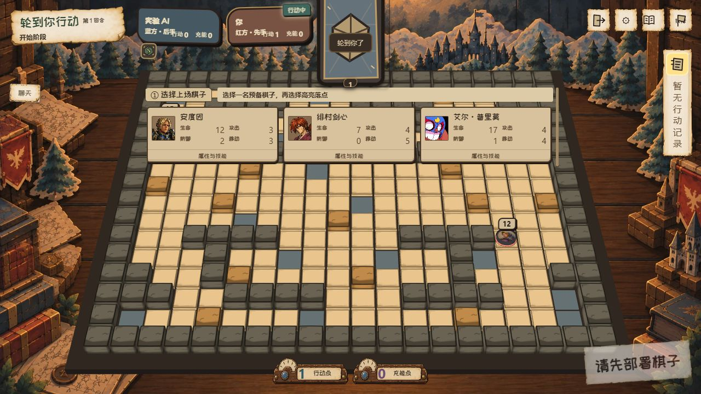

# RED-241 材质返工

2026-10-08 人工反馈：背景与计划不符；部署角色签满意，保留；隐藏工具有空位；聊天入口不明显。继续 PR #228。原视觉版本不视为通过人工验收。

## 改动与来源

使用内置 ImageGen，参考已选 `output/plans/tabletop-ui/concept.png`，制作无文字独立资产。原图存于本机 `.codex/generated_images/01a0fe4a-5e2c-75a3-ad85-910286259f5a/`。WebP 仅做等比缩小、透明外边距裁切和编码压缩，透明通道保留。无新增依赖。

| 项目资产（data/pages/images/tabletop/） | 生成源 | 用途 |
|---|---|---|
| paper-theatre-v2.webp | exec-0c1d796c-24e0-4357-ad18-4514378e9a16.png | 纸山林城堡、木桌、边缘地图和书堆；没有烘焙棋盘/UI |
| counter-v2.webp | exec-9360a94c-9ce8-4608-8e1e-e8d2f1185b16.png | 低矮木质计数盘，数字/标签仍为真实 DOM |
| paper-slip-v2.webp | exec-dfdf245c-a478-4d18-ab68-5d982d6d52c8.png | 提示、记录、工具与聊天的纸张边缘 |
| hourglass-v2.webp | exec-7053331e-5ecd-429f-8cb3-70408db9fc98.png | 空沙漏框，权威计时沙量继续由 SVG 投影 |

生成提示规格：

- 背景：16:9 warm hand-painted wooden tabletop; layered die-cut cardboard mountains/pine forest/castle across far top; narrow theatre wings left/right; worn map corners and books at extreme corners. Center 80% clear wood. Reference painterly ink outlines, ochre paper edges, desaturated blue-grey forest, restrained amber edge light. No board, grid, characters, cards, UI, numbers, text, lamps or hourglass.
- 计数器：single transparent low horizontal 3:1 wooden holder; half-exposed ivory cardboard counting wheel with irregular ticks; brass rivets, large blank pale parchment numeric window center-right 70%, small desaturated blue enamel pin left. Hand-painted ink, paper thickness and wood grain. Intended 138×48 slot. No numbers, text, symbols, pointer or scene.
- 纸条：single transparent blank landscape 3:1 parchment slip; ivory fibers, ochre worn irregular cut edges, curled lower corner, layered thickness and soft contact shadow; center 85% clean pale writing space. No text, numbers, tape, frame or scene.
- 沙漏：single transparent narrow vertical hourglass; carved warm wood caps/posts, tiny brass joints, empty transparent glass chambers, ivory reflections, painterly ink outline. No sand, numbers, text or scene; live sand overlaid by game.

部署候选、手牌区域及其字体/头像/大小未修改。工具条改为 max-content，隐藏项为零宽；原固定宽度是空位原因。聊天此前只在联网连接流程挂载，练习和训练没有入口；现明确展示离线状态，不伪造发送和回复。

## 验证

- 8 个直接相关 UI/预演/计时文件，45 项通过：battle-tabletop-ui、battle-deployment-ui、battle-dom-ui、battle-social、battle-social-transport、battle-move-preview、battle-skill-preview、turn-timer-status-ui。
- 聊天专项及页面契约 66 项通过；服务端社交 9 项通过，其中 2 项使用真实 Colyseus 双客户端（权限、重连、幂等与战斗状态隔离），另 7 项验证冷却边界、内容及协议。
- 受影响 JS/测试 ESLint、编码检查、diff 检查通过。
- 实际生产练习页 1280×720、1024×576、740×360：所有隐藏工具宽度为 0；工具条分别为 192/189/189px；聊天面板底部 381/317/263，均高于手牌顶部 430/486/270。短屏工具条额外 4px 为可见内边距，不是隐藏槽位。见 [布局数据](evidence/material-v2/layout.json)。
- 部署场景与聊天禁用说明实机截图见同目录。完整打包版、操作系统 DPI 与美术满意度仍等待人工候选体验；功能测试不代表美术验收。
- 集成 TypeScript 检查通过。独立复核发现观战工具全开时可能超出 HUD 预留宽度，已保留工具条最大宽度与左对齐滚动；两项专项文件 16 项独立测试通过。
- 使用生产 HTML/CSS 的隔离组件夹具（不是真实对局）：9999→9997、10000 无截断，scrollWidth 等于 clientWidth；完整工具条宽 304px、内容 347px，首按钮与容器左边界重合，可横向滚动。见 component-fixture.png。
- 真实训练页五个工具合计 242px；回合切换后手牌容器 1280×290、卡面190×240，与原候选一致。见 training-hand.png。

回退：撤销本轮材质/入口提交，保留此前游戏规则、预演及聊天服务端。
