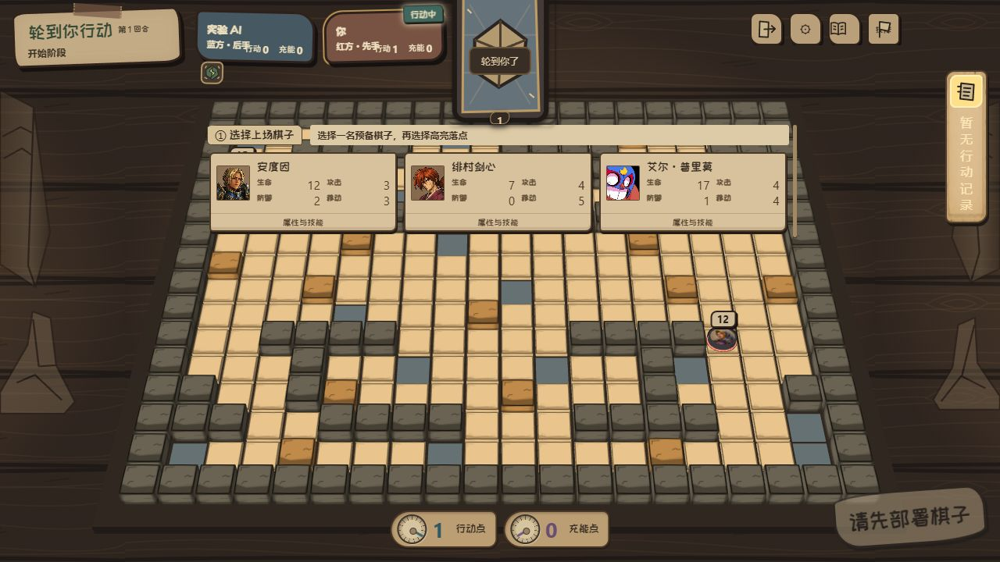
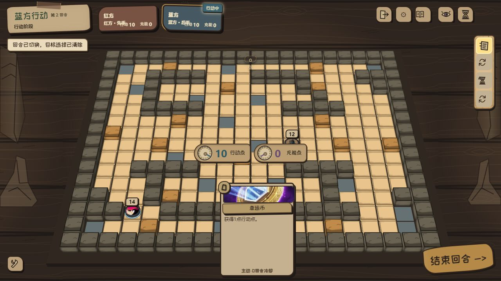

# RED-241 候选自检

状态：实现候选，等待独立复核与人工体验验收；未合并、未发布。

最新人工视觉反馈后的返工见 [扁平控件与聊天避让](FLAT_CONTROLS.md)，本轮 47 项相关回归通过。[材质与聊天入口 v2](MATERIAL_V2.md) 和下方原截图保留为历史记录，不代表最新控件美术。

- 合同：[RED-241](https://linear.app/redvsblue/issue/RED-241)
- 新鲜 main：`9d1b0c30801cd733ec4cede37ce1ef0889a2313a`，2026-10-08 fetch；check:main-baseline behind=0。
- 继承候选：`cb882cadc3a5f5249b1403ddf61e190f3aa9f909`；PR #226/#227 的预演、状态、路径和卡牌修复保留。
- 风险：High。用户已批准计划及实现。回退方式见 [接口说明](../../technical/RED241_TABLETOP_UI.md)。

## 已验证

30 个针对性 Vitest 文件，310 项通过。包含 HUD/昵称与部署、独立便笺与传输、真实 Colyseus 双客户端/原生重连、计时与部署规则、技能/路径预演隐私、天照/毒素、水门/暴风雪、窗口偏好与 IPC 信任。测试入口为 `node node_modules/vitest/vitest.mjs run <相关文件> --maxWorkers=1`。最后仅修正测试类型声明后，昵称投影 3 项重新通过。

Electron TypeScript 编译、排除已有 output/baseline 副本的 integration 类型检查、受影响源文件及新增测试 ESLint、编码检查、git diff --check 通过。Colyseus bundle 构建通过。本地曾缺少锁文件指定的 @better-auth/utils 0.3.1，使用忽略目录恢复该精确版本；未修改依赖清单或锁文件。ESLint 使用已有忽略目录 lint runtime。

真实 SDK 测试验证 t0/2999/3000 边界、类型共用冷却、玩家互不影响、重复请求只广播一次、session 更换后冷却保持、观战只读、异步会话撤销拒绝。发送前后 snapshot/hash/version/seed、journal 和持久化 battleState 不变。

实际 Electron 运行 `node tests/electron/fullscreen-window-preferences.smoke.cjs`：首次全屏 true → trusted IPC 窗口 false → 全屏 true 并收到状态事件 → 保存窗口 false → 重启保持 false。使用隔离 profile，未写原客户端配置。

生产页面 DOM 验证了训练营回合交接、设置内镜头/倍率入口、部署详情不选择、候选切换、选中后收起候选、一次点击完成部署、部署后鼠标仍可操作。普通练习对局不显示训练工具。

与继承候选的同一回合/同一手牌比较，1280×720、1440×900、1024×576 的手牌区域、卡面宽高完全一致。最后一个尺寸是 1280×720 在 125% 缩放下的等效 CSS 视口，不能当作真实操作系统 DPI 测试。详见 [几何数据](evidence/hand-geometry.json)。

便笺组件使用真实 production CSS/JS 与不发送网络的夹具验证：720/576/360/390/430 高度下，展开面板均在原手牌边界以上；小屏可滚动且高度为正。详见 [便笺几何](evidence/social-geometry.json)。

## 限制与待人工验收

完整 Next typecheck 仍被本地缺少 node_modules/.bin/next 以及既有 output/baseline 重复源码阻断；直接 integration tsc 排除该副本后通过，不能宣称全仓库 typecheck 通过。

Electron 窗口测试的候选日志有 server.js not found / PROFILE_SERVER_NOT_READY：此工作树未生成完整 Next standalone 客户端包。窗口状态与 trusted IPC 已实测，但完整打包客户端的对局、OS 125% DPI、满手牌悬停与多人对局视觉仍需候选包体验验收。Electron 43 CDP 无法创建第二个窗口，运行时未信任 sender 分支明确跳过；已有 IPC trust 21 项测试覆盖拒绝路径。结束缺少 standalone 的测试候选时，旧 startup 路径另有 destroyed window 警告，未扩大本任务去修改启动系统。

修改后的 Android/official smoke 镜头定位改为设置入口，仅检查脚本与路径，未执行完整 Android 安装或 official 发布冒烟。没有更新规则快照。

便笺需双方客户端和服务器具有本次协议；旧服务器显示不可用。记录限本场本地 50 条，房间进程销毁后不保留社交冷却或历史；该功能不进入战斗回放。

人工体验建议：打开战局查看名牌/回合 → 部署查看资料并更换角色 → 点高亮格上场 → 拖动路径与切换技能检查预演 → 打开设置切换倍率/F11 → 两端发送文字/印章并断线重连检查 3 秒冷却 → 满手牌、125% DPI 下检查遮挡。确认后再决定合并与打包，不自动发布。
