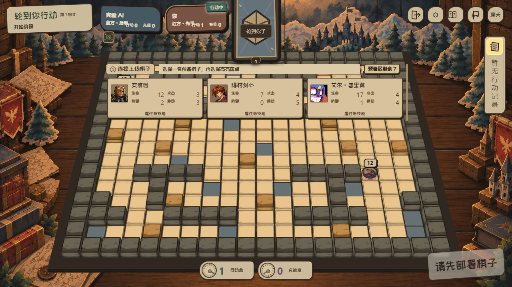
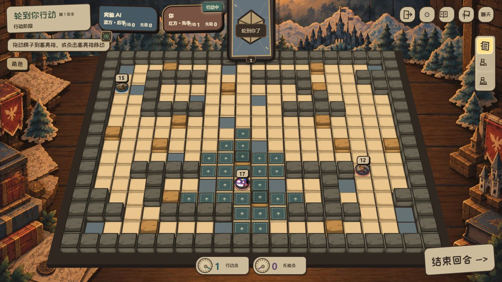

# RED-241 拖动路径与历史继承核对

base_branch: main
base_sha: 9d1b0c30801cd733ec4cede37ce1ef0889a2313a

用户最终要求：拖动和点击均完整展示路径并播放多段转弯；此前“自己松手后跳过动画”要求已取消。每个新部署机会展开候选，突出预备区剩余。继续原 PR #228，不替换已有候选。

## 历史来源

| 修复 | 历史来源 | 核对内容 |
| --- | --- | --- |
| 艾德加近身搏击 | 28e5e1fdf | 旧单次0.75倍改为两次0.5倍，每次实际伤害后回复1；死亡后停止 |
| 索尼克追踪攻击、剑心天翔龙闪 | 28e5e1fdf | 合法相邻落点内使用既有种子随机接口，保留统一位移提交 |
| 鼬天照初始强度 | 48e24c0a6 | 初始强度从2修为1，避免刚踏入就两层 |
| 猗窝座 | 4cd7617d8 | 原角色、技能、来源独立伤害标记及目标约束依赖；保留当前resolver与预演修复 |
| 阿方/一护弹射物、夏特侧射与动能、柯尔特免费移动 | 1416b1209 的 RED-218 部分 | 从地图/AI集成提交中拆出角色修复及必要Flow接口，不整提交覆盖 |
| 艾德加跳跃说明 | 55b334733、05150ee52 | 当前已存在，不回滚 |

当前候选旧艾德加 JSON 与实际 `/data/skills/edgar-fisticuffs.json`、`/__battle-data.json` 一致，原因是资源未继承，并非仅文案或浏览器缓存。QA 服务在启动时缓存 battle-data，资源更新后需要重启原端口再验证实际返回内容。

不复制历史生成引擎，使用当前源码重建；不整体覆盖 manifest。保留 RED-237/240 已继承的水门续选、暴风雪全图、状态中文图标、地格预演、毒素伤害、天照公开来源、胜利预演、浮字生命周期及技能选择重试，原核对记录见 `../RED-240-inheritance-audit.md`。

此前明确暂停的教程/PVE/AI仍排除；RED-218/219/220 的新增地图不是角色修复依赖，不从旧分支整包带回。免费移动虽然不是猗窝座依赖，但属于遗漏的柯尔特角色修复依赖，因此本轮与柯尔特一起恢复。

## 部署回归

原本局部选择/收起状态跨部署机会保留，新机会按权威revision与行动玩家清理旧选择并展开；同机会重新render保持用户当前选择。数量来自玩家可见投影，对方等待界面不显示私有预备区。

实际1280×720曾发现旧底部计数位于面板裁切范围外；改到单行头部，候选和详情按钮保持可见。

## 验证状态

拖动问题的最小复现为：拖动预演 → 权威动作开始播放 → 清除预演 → 更新最终局面。原清除预演逻辑会取消动作队列和逐段动画；预演棋子还可能停在假想终点，导致第一段被跳过。现仅完整棋盘替换取消播放，预演更新保留队列；新动作从该动作的 previousModel 恢复起点。真实 renderer 的 pointerdown/move/up 回归覆盖本人/对方、路径传递、各转弯段、旧预演晚到、状态恢复及离场清理。

用户批准核对后同步目标快照。最终完整 hash：`641b8def8f2791461ea9ea4e630558a53442c0aaa90a9d0fcbc7f50ff092dee3`。移除新增四个 `akaza-*` 和 `colt-big-stride` 后仍等于原 `d1a6089556d1da07a5fc2c5ccfbf7614b34dc22aa3a25fa772c8fe3a752f1991`，测试同时保留两者，避免以整体换 hash 掩盖旧角色候选变化。

- 13 个移动、部署、预演隐私、技能选择、水门、暴风雪、天照、目标筛选与 RED-227 测试文件：165 项通过。
- 9 个猗窝座、RED-218、免费移动及实际浏览器引擎测试文件：66 项通过。以上本轮直接验收共 22 文件、231 项通过。
- 三个引擎均由当前源码重新构建；集成 TypeScript、受影响文件 ESLint、编码、资源继承和 main 基线检查通过。独立审查最终复跑 9 文件、106 项通过，无尚未解决的实质性发现。
- 原 38682 服务已重启；33 个受保护资源与源文件一致，其中 32 项在实际 battle-data 内，已按 RED-211 从角色移除的葛力姆乔王虚闪只核对静态资源留存。完整清单见 `evidence/route-inheritance/served-resources.json`。
- 实际 38682 页面已检查艾德加双击说明、猗窝座候选及部署卡详情可见；多段拖动通过真实 renderer 输入回归验证，未将其表述为完整 Electron 双端人工体验验收。
- 原 HEAD `65a7337` 的独立临时工作树复现了 6 个既有失败：一护旧文案、词条缺“治疗”、索尼克/夏特旧文案、索尼克冲刺范围、冲刺位置/动能、超级形态动能。未通过放宽断言将这些问题隐藏。
- 最终完整 Ichigo/Sonic 两文件重跑：61 项通过、上述 6 项仍失败；不能据此声称全库测试通过。另有旧 practice 测试暴露 `waitingForOtherPending` 未定义及 15/16 fixture 数量差异，未纳入本轮教程/AI改造。全库类型检查的既有 output/重复声明问题仍在，集成类型检查不等于全库检查。

本轮风险 Medium；撤销本轮修复提交可回退，不修改存档，不自动合并或发布。完整桌面端双人行走观感、125% DPI 仍需人工验收。

## 人工验证

1. 重载同一 38682 候选，重新开始练习或训练，避免旧局面的角色定义缓存。
2. 拖动棋子选择至少两次转弯，确认数字、粗路径及沿途局面预演；松手后本人和对方按各段完整播放，结束后可继续操作。
3. 点击移动仍正常；取消预演、切换技能、连续动作不吞路径或卡住鼠标。
4. 每次新部署机会自动展开候选，预备区剩余数可见，卡片详情和手牌空间不受遮挡。
5. 检查艾德加双击回复、天照初始一层、猗窝座来源标记、阿方/一护友军阻挡、夏特侧射、柯尔特大步流星。

## 人工反馈：只有路径线的二次定位

上述渲染器回归没有覆盖完整的事件转换链，不能据此证明实际页面动画已通过验收。人工在同一 38682 候选发现仍只显示路径线。

`BattleViewModel.normalizePresentationEvents` 会将未提供的 `targetPieceIds` 规范为 `[]`；普通移动事件只携带 `sourcePieceId`。`BattlePresentation.playbackPhase` 原先使用 `event.targetPieceIds || [sourcePieceId]`，空数组为真，导致移动事实没有作用到任何棋子。演出队列仍显示路径线，到结束才同步最终局面。旧 sequential 测试传入未经规范化的原始事件，因此绕过了这一错误。

修复优先使用非空目标列表，并仅在没有目标的移动事件中回退到移动源；强制移动仍使用明确的被移动棋子，不再把路线赋给施法者。

新增的三个规范化事件回归在修复前全部失败；修复后，真实事件规范化 → 演出队列 → 真实渲染器代码的联合测试对本人与对方各采样40帧，要求访问四个行走段的内部（排除只碰拐点的假通过），并要求每帧都在路径上。五个相关测试文件共134项通过；集成TypeScript、相关ESLint、编码、diff及最新main基线检查通过。独立审查另复跑两文件77项通过，无未解决的实质性发现。

实际38682候选重新加载脚本后，点击移动两格含一次转弯成功，角色到达落点、首移免费次数消耗正确，后续操作仍可用。静态截图只证明最终局面与操作可用性，不证明逐帧播放。CUA鼠标工具不能输入多段曲线，拖动多转弯观感仍需人工重验；其完整事件和逐段坐标已由联合回归覆盖。

