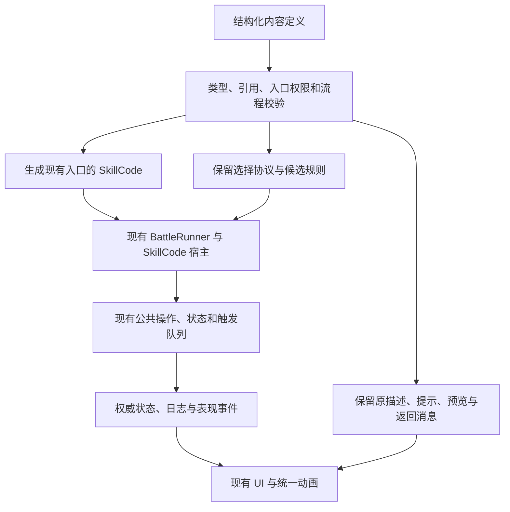
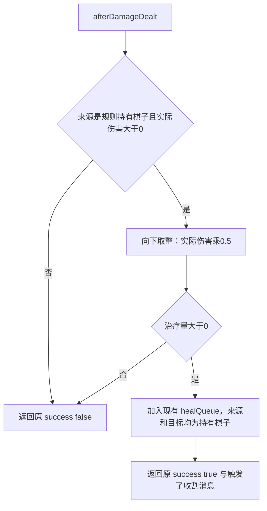
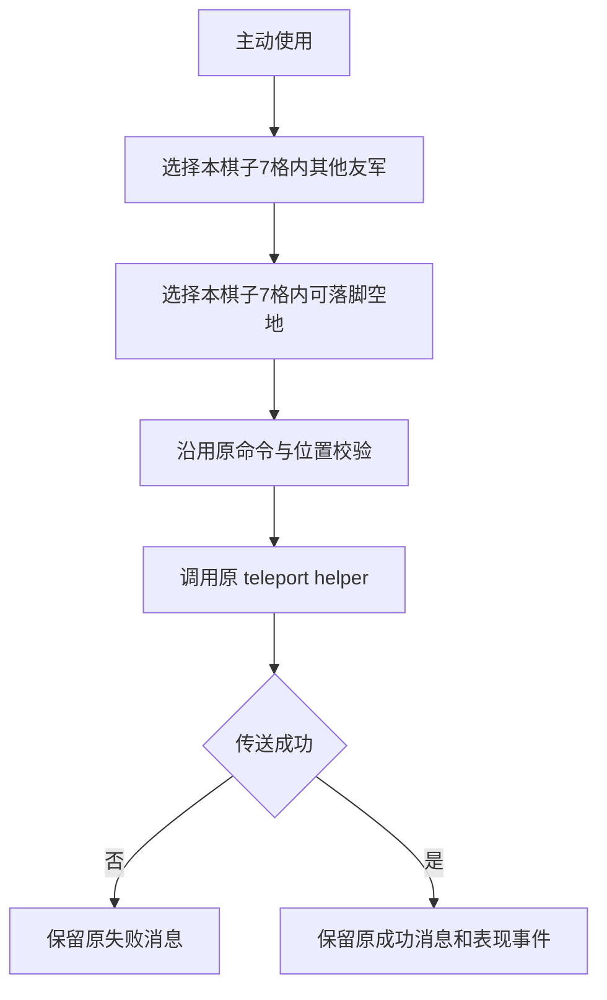
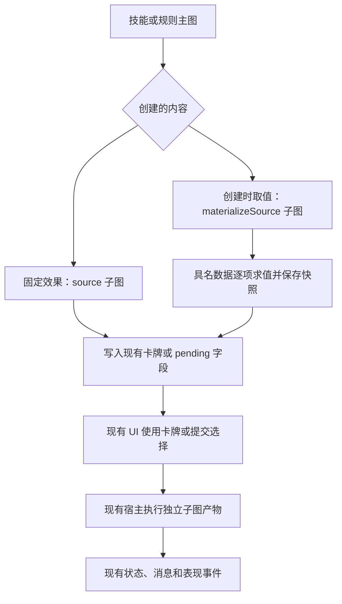

# RED-252：现有内容模块化流程图迁移

状态：普通对局的 276 个代码主入口与 84 个预览入口已迁移；候选验证及独立审查结果见 [验证记录](../qa/RED-252-verification.md)。不代表人工体验验收。

- 合同：[RED-252](https://linear.app/redvsblue/issue/RED-252)
- `base_branch: main`
- `base_sha: 00df31f8bd35b34200d507fd83853bf5ac99ba94`
- 用户批准：保持现有普通对局规则、游戏内交互、动画逻辑、日志与文字，使用模块化图表达现有内容。

## 迁移边界

普通对局的棋子、可用卡牌、全局规则是入口；跟踪替换技能、衍生手牌、召唤模板、状态关联规则及选择续接。注册文件不等于可达内容。冒险专用内容单独标记；动态引用未核实不能计入覆盖完成。

本次不实施此前讨论但未落地的新规则，包括候选区扩展、逐格位移改造、复活身份及新状态叠加方式。不改变随机算法、存档格式、网络协议或外部代码准入。现有文字与数值的矛盾作为兼容项保留，不在迁移中修正。

## 编写与执行草案

控制流和数据引用分开。数据连线不执行效果；带副作用的能力只有获得控制流时才能运行。主动技能、卡牌、内联规则、触发技能、pending 和预览具有不同入口权限。暂停和继续使用现有权威协议，不建立第二套战斗状态。

| 节点族 | 职责 |
| --- | --- |
| 查询与选择 | 对象查询、范围、集合、玩家选项和目标 |
| 数值与条件 | 常量、属性、事件结果、运算、判断 |
| 基础操作 | 伤害、治疗、位移、状态、资源、手牌、技能和生命周期 |
| 状态与规则 | statusTag 数据及其附带规则、来源和计时 |
| 事件与流程 | 入口、分支、顺序、现有批次、返回、等待续接 |
| 记录与引用 | 保存引用、计数、进度及指定时机读取 |

不能用一个执行旧脚本节点计为已迁移。尚未支持的节点或入口明确失败；尚未迁移的内容继续使用原代码，单份内容只保留一个生产执行来源。图诊断不添加玩家日志，不消耗随机数，不改变返回值。

本图编译器接入现役受信内容执行器，不是 `rvb-skillcode/v1` 沙箱 adapter。[冻结 ABI](SKILLCODE_ABI_V1.md) 明确描述未来受限运行时，并说明其未接入现役执行器。为保持当前内容行为，图中已有的 `console.log/error` 仍作为显式副作用节点调用现役宿主；这不修改未来 ABI 的 console 禁令，也不开放外部脚本准入。JSON 序列化同样作为显式操作，避免将可能调用 `toJSON` 的操作误当纯表达式。

## 实例：收割

保留 queue 写入，不替换成同步治疗。图不再制造第二次伤害事件。

## 实例：神威·转移

两个选择的范围中心均为施放者。准备阶段、取消、过期输入、提交和重放沿用现有 targeting 协议。

## 字段与兼容

### 开发者如何使用

在资源编辑器中打开技能、卡牌或规则，切换到流程图；技能可分别选择主入口与预览入口。画布负责节点位置和控制流连线，右侧参数区编辑结构化 JSON。当前是开发者雏形：嵌套循环、函数和子图通过结构化参数编辑，尚不是面向玩家的全拖拽组卡界面。

`contentGraph` 保存主入口，`contentGraphEntries` 保存独立预览等入口；`code`、`skillCode`、`previewCode` 是生成产物。编辑图后重新生成代码，保存时检查图与产物一致。临时无效图可以继续修复，但不能保存；未知扩展字段保留。原有代码编辑器对关联产物只读，显式解除关联后才能独立改代码。

格式版本为 `rvb-content-graph/v1`，编译器版本为 `rvb-content-graph-compiler/v1`。类型和能力目录以 [content-graph.ts](../../electron-editor/content-graph.ts) 中的 `ContentGraphExpression`、`ContentGraphNode`、`CONTENT_GRAPH_CAPABILITIES` 为准；能力目录声明允许的入口、参数和返回类型。文档级入口及多字段校验在 [content-graph-document.ts](../../electron-editor/content-graph-document.ts)。

| 可组合结构 | 使用方式 |
| --- | --- |
| 值与引用 | 常量、属性、对象、数组、运算、纯查询；引用必须在可用作用域内 |
| 顺序操作 | `bind` 保存结果，`call` 调用允许的宿主能力，`set` 更新结构化数据 |
| 条件与迭代 | `branch`、结构化 `loop`、`break`、`continue`，保留原执行顺序 |
| 函数与集合 | 独立函数图、`invoke`，区分纯集合查询与带副作用的回调 |
| 返回与异常 | `return`、`try`、`throw`，保留成功、失败和异常路径 |
| 派生内容 | `source` 和 `materializeSource` 创建独立且经过校验的卡牌或续接子图 |

现有描述、提示和消息模板作为同一内容定义中的兼容字段保留；预览单独编译并对照。此阶段没有从任意图自动创造自然语言描述的能力。新增设计必须同时填写描述、图和必要预览，再验证它们一致。

### 生成内容和等待续接

生成卡牌也是图的一部分。固定卡牌效果用独立 `card` 子图；创建时需要保存的数据，通过 `materializeSource` 节点的具名绑定按顺序求值和快照。子图不能隐式读取父图局部变量。等待选择的效果用独立 `pending` 子图，继续使用当前引擎保存的 payload、选择候选和取消规则。

这里的源代码是编译产物，不能由可编辑的任意脚本节点替代。子图与主图共享编译预算，分别校验入口和引用。差分测试必须验证生成的卡牌确实能使用、续接确实能完成；只比较首次返回的选择提示不足以验收。

图编译不得删除其他入口和扩展字段，不得统一把规则和卡牌改成主动技能。描述、提示、日志模板保留原字节和插值来源。已有数值矛盾采用显式兼容项；例如 `holy-light-descend` 的外圈正文是5、执行和预览数值是4，此任务保留。

生成代码和内容指纹可以改变，权威可观察行为必须保持。运行中的对局不切换内容版本；遵守现有版本门禁。不能为通过差分而任意排除状态、随机流、pending、日志或表现差异。

## 验证门槛

1. 原内容与图产物使用同一初始状态、输入序列与种子，逐步比较状态、返回、费用、冷却、次数、随机流、日志、表现事件及公开投影。
2. 比较目标准备、候选、选择顺序、取消、错误玩家、过期、重复输入及暂停续接后的结果。
3. 描述与提示逐字比较。图派生诊断与构建指纹的差异单独登记，不污染游戏日志。
4. 真实编辑器创建、修改、保存、重开和冲突保护；Node/浏览器与候选游戏交互验证。
5. 每批独立提交、记录覆盖数和未迁移项；全量普通对局依赖完成且验证后才能宣布迁移完成。

## 回退

按内容与对应编译能力成组回退。不得只回退内容或只回退所依赖的能力，不删除用户资源项目。回退不宣称能无损切换进行中对局。不得自动更新冻结快照、合并或发布。
