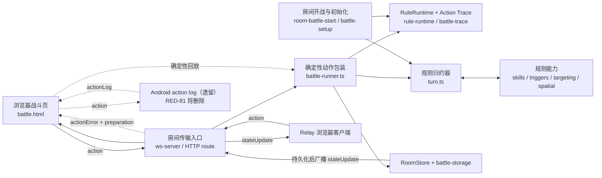
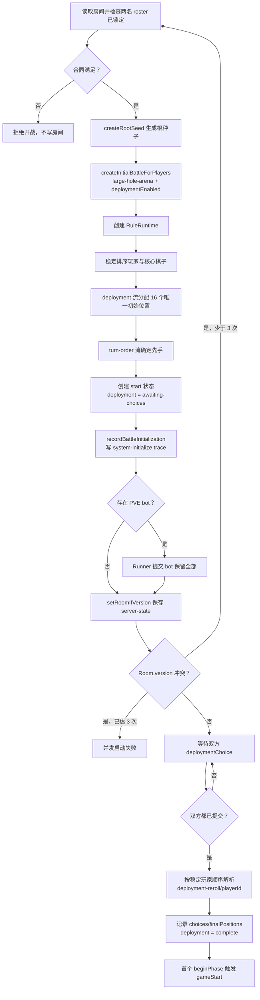
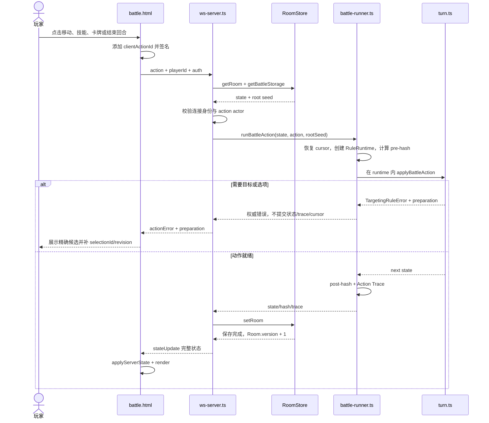
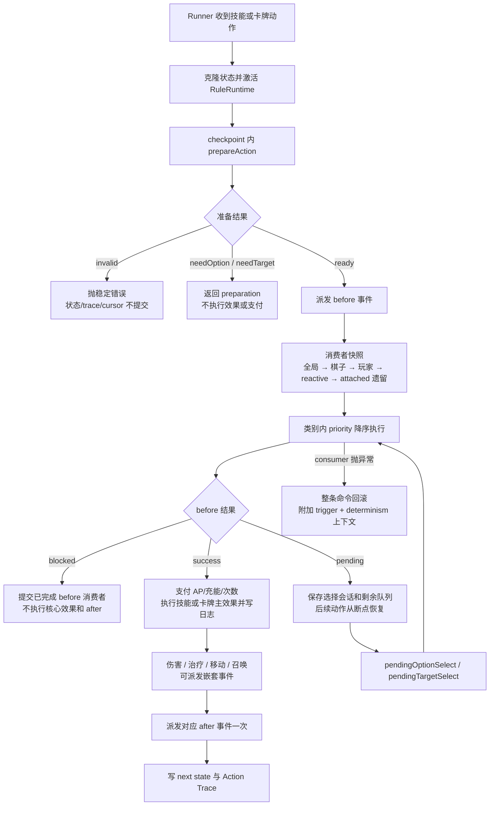
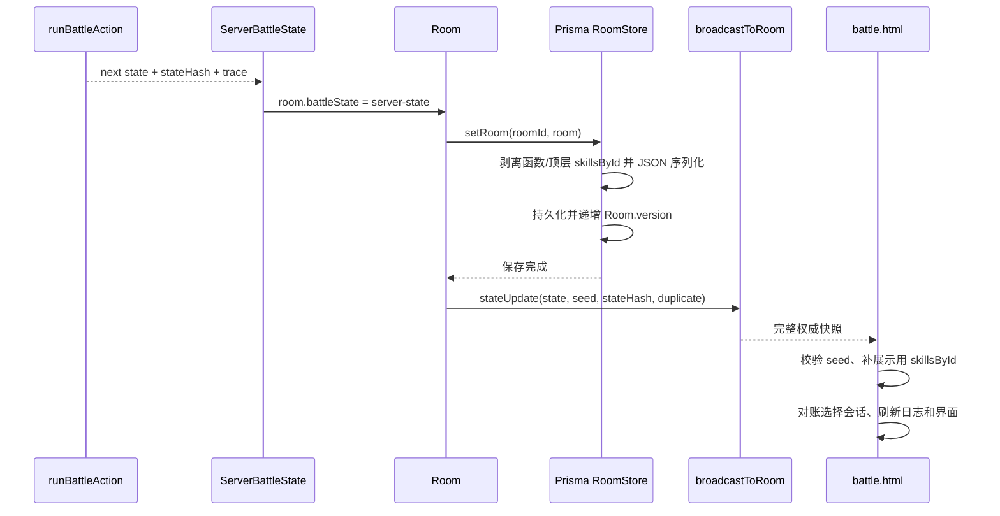

# 游戏逻辑系统接口与执行流程

状态：RED-79 当前代码核对稿

核对基线：`b8201dd`（2026-08-17）

架构约定更新（2026-08-17）：Windows 的服务端完整状态方案是唯一目标标准；Android 现有 action-log 是 RED-81 将完整删除的遗留实现，不再作为可长期并存的第二套框架。动态代码执行的集中编译与缓存由 RED-82 跟进。

适用范围：TypeScript 规则核心、Windows LAN、浏览器战斗页、Relay 与 Android 内嵌服务。

本文面向开发、调试和测试人员，集中说明当前游戏逻辑系统的公共接口、权威边界和典型执行顺序。模块细节可继续查阅 [`MODULE_INTERFACES.md`](./MODULE_INTERFACES.md)、[`ENGINE_CORE.md`](./ENGINE_CORE.md) 和 [`ARCHITECTURE.md`](./ARCHITECTURE.md)。

## 1. 阅读约定与核心结论

本文使用三种状态标记：

- **当前实现**：已与核对基线中的源码和相关测试对照。
- **历史兼容**：仍可被当前代码读取或执行，但不是新增功能应采用的首选边界。
- **目标设计**：ADR 或架构文档提出的方向，当前尚不可调用。

先记住七个结论：

1. `lib/game/turn.ts::applyBattleAction()` 是规则归约入口；`runBattleAction()` 是需要确定性、hash、幂等和 Action Trace 的权威包装入口。
2. `RuleRuntime` 用一个根种子派生命名随机流、逻辑时钟和实例 ID；权威初始化必须先创建 seed，后续每个动作必须沿用同一 seed。
3. `targeting.ts::prepareAction()` 是纯查询合同，返回精确候选和选择凭证；最终提交仍由归约器使用同一验证器复核。
4. Demo 房间在普通回合前有同时部署门禁；双方提交 `deploymentChoice` 后才完成部署，首个 `beginPhase` 才触发 `gameStart`。
5. Windows LAN 的“服务端执行命令、保存完整状态、广播完整状态”是唯一跨端标准；Android 当前 action-log 只是待由 RED-81 删除的遗留实现。
6. 胜负判断仍主要位于 `battle.html::checkClientGameOver()`，尚未收敛为服务端 `GameResult` 规则接口。
7. JSON 中的技能代码使用 `eval` 会产生重复编译成本，但更重要的是它只把内容与主代码分开发布，并没有隔离权限；RED-82 将集中编译、缓存和失效处理。

## 2. 系统总览

### 2.1 模块与依赖关系

实线表示 Windows LAN 主路径；虚线表示查询、兼容或客户端权威路径。



### 2.2 运行模式与权威边界

| 运行模式 | 当前共享权威 | 动作执行 | 保存与同步 |
| --- | --- | --- | --- |
| Windows LAN WebSocket | Prisma 房间中的 `server-state` | 服务端 `runBattleAction(state, action, { rootSeed })` | `setRoomIfVersion()` CAS 成功后广播完整 `stateUpdate` |
| 房间 HTTP `POST` | 与 Windows LAN 相同 | 服务端校验 actor 后调用同一共享命令服务 | CAS 保存后广播；HTTP 同时返回 state/hash |
| Android 内嵌房间（当前遗留） | 内存 `action-log` | 浏览器 Runner 生成 trace 并按日志确定性回放；移动服务只校验 trace 形状/链 | 追加带 `seq` 的日志并广播 `actionLog`；RED-81 将完整删除该框架 |
| Relay | 同合同的远端权威房间服务 | 浏览器只发送 action | 只消费服务端 `stateUpdate`；旧 host 权威协议被拒绝 |
| Training / Debug | 各自的训练或调试状态 | 新旧入口并存；部分旧路径可不带 seed | 不等同于房间权威链，不应用来证明跨端一致性 |

> **历史兼容：** `getBattleStorage()` 仍能读取旧 `action-log` 和裸 `BattleState`。这只是恢复兼容，不表示三种格式具有相同的权威语义。

### 2.3 Windows 与 Android 可以统一到什么程度

结论是：**玩家看到的功能、游戏规则、命令语义和权威状态标准必须相同；操作系统外壳可以采用不同实现。** 当前 Windows 的 `server-state` 与 Android 的 `action-log` 分裂是待删除的历史架构，不是需要保留的平台差异。

| 边界 | 应当共用 | 必须平台适配 |
| --- | --- | --- |
| 规则核心 | `BattleState`、`BattleAction`、`runBattleAction()`、Targeting、Spatial、RuleRuntime、Trace | 无 |
| 命令协议 | actor、request/action ID、root seed、action、结果/error envelope | 传输编码和连接生命周期 |
| 权威执行 | 同一初始状态、seed 和命令必须产生同一 hash/trace | Windows 在 Node 进程；Android 可在隐藏 WebView 的 browser-safe bundle |
| 网络 | 相同的订阅、动作、错误和状态消息语义 | Windows Node WebSocket/HTTP；Android Java Socket/Bridge |
| 存储 | 相同的版本化 `server-state` 格式和恢复合同 | Windows Prisma；Android 本地数据库/文件适配器 |
| 系统能力 | 通过接口注入 entropy、storage、broadcast、日志 | Node 文件系统与 Android 生命周期/权限不同 |

通俗地说，Windows 像“裁判在服务器上算完比分，再把记分牌发给所有人”；Android 现在则像“只广播每一步操作，让每台手机自己重算比分”。后者更容易因为版本、丢包或恢复顺序不同而分叉，所以不再保留。

| 对比项 | Windows 当前标准 | Android 当前遗留 | Android 迁移后 |
| --- | --- | --- | --- |
| 谁计算共享结果 | 房间服务端 | 每个客户端分别回放 | Android 房间宿主中的同一 Runner |
| 服务端保存什么 | 完整 `server-state` | `actions + seq + seed` | 完整、版本化 `server-state` |
| 客户端收到什么 | 完整 `stateUpdate` | `battleSnapshot` / `actionLog` | 与 Windows 同语义的状态与错误消息 |
| 重连恢复 | 读取完整权威状态 | 从 init 开始重放日志 | 读取完整权威状态 |
| 进程生命周期 | Windows 进程可能退出，由桌面外壳处理 | Android 后台更容易被系统暂停或回收 | Android 前台服务/通知、恢复和持久化适配；不改变规则协议 |

迁移不是把 Next.js、Prisma、Electron 或 Windows 文件系统整个塞进 Android。Android 隐藏 WebView 可运行同一个 browser-safe Runner 并保存完整状态；Java 层只适配 Socket、前台服务、通知、权限、本地存储和系统恢复。这样“发动机和交通规则”相同，只是 Windows 与 Android 使用不同的外壳和启动方式。

RED-81 将删除生产路径中的 `action-log` / `actionLog`、`battleSnapshot.actions/seq` 和客户端按序回放分支，不保留双模式或兼容降级。`BattleActionTrace` 可以作为权威执行后的调试证据继续存在，但它不是状态来源，也不是 action-log 的改名版本。实施顺序是先稳定 Windows 标准，再迁移 Android。

## 3. 核心数据与公共接口

### 3.1 `BattleState`

定义：`lib/game/turn.ts::BattleState`。

| 字段 | 作用 | 主要修改者 |
| --- | --- | --- |
| `map` | 棋盘尺寸、格子和地形属性 | 初始化、空间规则 |
| `pieces` / `graveyard` | 场上与死亡棋子实例 | 移动、伤害、召唤、死亡结算 |
| `pieceStatsByTemplateId` | 模板基础属性索引 | 初始化 |
| `skillsById` | 运行时技能定义缓存 | 初始化和服务端/浏览器水合；不属于跨端权威 hash |
| `players` | AP、充能、手牌、弃牌、玩家规则 | 回合、卡牌、技能、触发器 |
| `turn` | 当前玩家、回合号、`start/action/end` 和动作标志 | `beginPhase`、`endTurn`、归约器 |
| `deployment` | 同时部署状态、选择、初始/最终位置 | 初始化、`deploymentChoice` |
| `actions` | 面向 UI/调试的战斗日志 | 归约器与效果 |
| `extensions` | 角色扩展及 `debugBattle` Action Trace | 技能、规则、Runner |
| `pendingOptionSelection` | 挂起的选项选择 | 规则/技能和恢复动作 |
| `pendingTargetSelection` | 带来源、步骤、候选和凭证的版本化目标会话 | targeting、规则/技能和恢复动作 |
| `targetingRevision` | 目标查询的新旧状态修订；成功动作单调加一 | `applyBattleAction()` 外层 |
| `gameStartFired` | 防止 `gameStart` 重复触发 | 初始化/首个阶段推进 |
| `_v` | 战斗状态序列化版本 | 克隆和归约器 |

边界：

- `safeCloneBattleState()` 以 JSON 方式克隆，再恢复棋子、墓地和玩家规则的 `effect` 函数，并写入当前 `_v`。
- Runner 执行前补回服务端技能，执行后剥离顶层 `skillsById`；`hashBattleState()` 还排除 `extensions.debugBattle`。
- `extensions` 是开放结构，不应把其中任意新字段默认视为稳定网络协议。

### 3.2 `BattleAction`

定义：`lib/game/turn.ts::BattleAction`。

| 动作 | 关键输入 | 主要结果 |
| --- | --- | --- |
| `beginPhase` | 无 actor 字段 | 推进 `start → action` 或 `end → 下一回合 start` |
| `deploymentChoice` | `playerId`、可选 `pieceId`、可选 `clientActionId` | 空棋子表示保留全部；双方提交后稳定解析换位 |
| `move` | 玩家、棋子、`toX/toY` | 共享空间规则校验后移动并扣 1 AP |
| `useBasicSkill` / `useChargeSkill` | 玩家、棋子、技能、目标/选项 | 校验资源、冷却、选择凭证并执行技能 |
| `playCard` | 玩家、手牌实例、目标/选项 | 校验 AP、目标和卡牌类型后执行/弃牌 |
| `endTurn` | `playerId` | 执行结束逻辑并进入 `end` |
| `grantChargePoints` | 玩家、数量 | 调整充能点 |
| `surrender` | `playerId` | 处理投降规则；终局仍由客户端检查收口 |
| `pendingOptionSelect` | 玩家、选择值 | 恢复挂起的效果/触发队列 |
| `pendingTargetSelect` | 玩家、目标和选择凭证 | 复核版本/候选后推进或完成挂起会话 |
| `cancelPendingSelection` | 玩家、`selectionId/stateRevision` | 仅取消当前、属于该玩家且允许取消的会话 |

技能、卡牌及 pending target 的 `TargetedActionFields` 包含 `selectionId`、`stateRevision`、坐标、目标棋子和附加目标。Runner 还兼容读取 `clientActionId` 或 `requestId` 作为幂等 ID；当前只有 `deploymentChoice` 在联合类型中显式声明了 `clientActionId`。

### 3.3 Runner、Trace 与回放

定义：`lib/game/battle-runner.ts`、`lib/game/battle-trace.ts`。

```ts
interface BattleActionResult {
  state: BattleState
  stateHash: string
  actionHash: string
  duplicate?: boolean
  trace?: BattleActionTrace
}

interface BattleReplayResult {
  initialHash: string
  finalState: BattleState
  finalStateHash: string
  actionHashes: string[]
  stateHashes: string[]
  actionsApplied: number
}
```

`BattleActionTrace` 记录 `index/rootSeed/actionId/actionHash/tick/turn/playerId`、前后状态 hash、各随机流的起止 cursor，以及可选部署证据。稳定 JSON 和 browser-safe SHA-256 位于 `battle-trace.ts`；这些字段服务于复现和差异定位，不等于数字签名或共识协议。
### 3.4 确定性规则运行时

定义：`lib/game/rule-runtime.ts`。

| 接口 | 作用 |
| --- | --- |
| `RuleRuntime({ rootSeed, cursors, tick })` | 创建动作级同步运行时 |
| `nextRandom(name)` / `nextInt(name, max)` | 从命名流消费确定性随机数 |
| `nextInstanceId(namespace, prefix)` | 从 `instance-id/<namespace>` 流创建稳定实例 ID |
| `clock.now()` | 以 action tick 为基础提供确定性逻辑时间 |
| `snapshot()` / `restore()` | 保存和恢复随机、时钟及最后访问位置 |
| `withRuleRuntime(runtime, operation)` | 在同步作用域内激活 runtime |
| `withRuleRuntimeCheckpoint(operation)` | 执行预检，但无论结果如何都恢复 cursor/时钟 |
| `getRuleMath()` / `getRuleDate()` | 给动态技能、规则和附加效果注入确定性的 `Math` / `Date` |
| `createRootSeed()` | 从安全随机源创建 32 位根种子；不可用时失败关闭 |

稳定命名流至少包括 `deployment`、`deployment-reroll`、`turn-order`、`skill/effect`。部署重选在其后追加 `/<playerId>`，实例 ID 使用独立命名空间。算法和兼容要求见 [ADR-0004](../decisions/ADR-0004-deterministic-rule-runtime.md)。

运行时是进程级同步作用域：规则执行不能跨异步边界持有它。没有 runtime 的训练/兼容入口仍可落到 `lib/game/rng.ts`，但权威房间入口不得依赖该回退。

### 3.5 权威目标选择

定义：`lib/game/targeting.ts`。

| 接口 | 输入 / 输出 |
| --- | --- |
| `prepareAction(state, draft)` | 只读状态与动作草稿；返回 `ready | invalid | needOption | needTarget` |
| `validateTargetRef(state, constraint, ref)` | 用同一约束验证最终棋子/格子引用；成功返回 `undefined` |
| `assertActionTargetingReady()` | 把 preparation 的非 `ready` 结果转成 `TargetingRuleError` |
| `assertActionPlayer(expected, action)` | 比较已认证玩家与动作 actor；系统动作可无 `playerId` |
| `finalizePendingTargetSession()` | 写入会话来源、候选、`selectionId` 和 `stateRevision` |
| `validatePendingTargetSubmission()` | 拒绝过期、错 ID、错玩家、已解决或非法目标 |
| `assertPendingTargetCancellation()` | 验证取消权限、版本和会话 ID |
| `stampTargetingRevision(previous, next)` | 每个成功动作只增加一次目标修订 |

`needTarget` 返回的是精确候选，不是 UI 提示。查询不得运行 reducer、触发器、效果、时间或 RNG；AI、UI 与最终提交复用同一候选/验证合同。无法声明动态目标步骤时以 `TARGET_DECLARATION_MISSING` 失败关闭。当前协议版本为 `TARGET_SELECTION_PROTOCOL_VERSION = 1`；ADR-0005 仍是 Proposed，见 [ADR-0005](../decisions/ADR-0005-authoritative-target-selection.md)。

### 3.6 空间与普通移动

定义：`lib/game/spatial.ts`。

| 接口 | 语义 |
| --- | --- |
| `manhattanDistance()` | 默认格子距离；坐标缺失时抛 `RangeError` |
| `getManhattanArea()` / `getSquareArea()` | 明确区分菱形曼哈顿范围与方形范围 |
| `getOrthogonalLineCells()` | 返回不含起点、包含终点的横/纵路径；斜线返回 `null` |
| `getLivingOccupantAt()` | 仅查询场上存活占位 |
| `getNormalMoveRejection()` | 返回稳定拒绝代码，校验边界、直线、范围、地形和占位 |
| `getLegalNormalMoveTargetsForPlayer()` | 在阶段、actor、AP、所有权均有效时给 UI/AI 精确普通移动集合 |
| `traceProjectile()` | 返回有序的 `cell → living piece → terrain` 事实及首个边界事实 |

这些函数不决定具体技能效果。普通移动的权威归约、AI 与浏览器高亮共用它们；技能位移、推拉、传送和弹道停止策略必须显式选择规则，不能暗用普通移动语义。

### 3.7 技能、卡牌与触发器

主要定义：`lib/game/skills.ts`、`lib/game/triggers.ts`。

> **迁移中的历史遗留：** 核对基线仍包含 `lib/game/attached-effect.ts`、第五类触发消费者及 `data/effects/**`，所以本节保留其当前执行顺序；但 [RED-80](https://linear.app/redvsblue/issue/RED-80) 的静态调用图已确认内置内容没有生产入口，现役玩法已经统一使用 Rule + statusTag。RED-80 正在删除该模块、数据、helper 和消费者阶段；不要新增 AttachedEffect 调用。[RED-75](https://linear.app/redvsblue/issue/RED-75) 是随后重跑 Node/浏览器执行面差分的测试任务，不是实际删除实现的任务。

- `SkillDefinition`、卡牌定义和 `TriggerRule` 保存元数据、资源、目标声明、动态代码及优先级。
- `executeSkillFunction()` / `executeCardFunction()` 在传入的战斗副本上执行数据驱动效果。
- `dealDamage()` / `healDamage()` 处理数值并派发对应 before/after 事件。
- `TriggerSystem.checkTriggers(battle, context)` 收集和执行一个事件的消费者；`fireEvent()` 保留父子事件链。
- `globalTriggerSystem` 是进程级实例；初始化会清理/注册规则，这是当前跨房间隔离的重点风险。

核对基线中的消费者大类顺序为：

1. 全局规则；
2. 棋子实例规则；
3. 玩家规则；
4. reactive 手牌；
5. AttachedEffect（内置内容不可达，RED-80 正在移除）。

同一类别按 `priority` 降序；未设置视为 0；同优先级保持快照/收集顺序。嵌套事件最大深度 20，每条根事件链最多分发 100 次，超限返回带事件链的阻断错误。规则、响应牌或基线中的遗留附加效果抛异常时会附加 `event/consumer` 上下文并重新抛出，Runner 不提交该命令；规则定义无法重新加载时当前会写日志并跳过。

### 3.8 JSON 动态代码与 `eval`

当前技能、卡牌和规则把一部分可后续开发的效果代码保存在 JSON 中，再由规则模块直接 `eval`。这让内容可以独立于主进程源码更新，但代码仍然在调用它的 Node 或浏览器进程中执行：它能访问传入对象和该进程暴露的能力，因此这不是安全沙箱，也不是进程隔离。注入确定性的 `Math` / `Date` 解决的是复现问题，不会自动限制权限；单纯把 `eval` 换成 `new Function` 也不会改变这一点。动态代码只应加载受信任、经过版本和 hash 校验的项目内容。

核对基线中有 8 个直接 `eval` 调用点，分布在 `rule-loader.ts`、`skills.ts`、`triggers.ts` 和 `turn.ts`。数据面约含 110 段技能代码、16 段卡牌代码与 54 段 Rule `skillCode`；AttachedEffect 的动态代码由 RED-80 删除，不纳入长期方案。本机 Windows Node 的一次冷编译诊断约为技能 4.0 ms、卡牌 0.8 ms、Rule 4.6 ms。这只测“把字符串编译成函数”，不包含状态克隆、执行、日志、hash、浏览器或 Android 成本，因此不能当成整场性能结论。

真正值得优化的是重复次数：一次玩家操作可能先进行 dry-run，目标高亮还会对许多候选格逐个 dry-run，最终提交又执行一次。如果每次都重新 `eval` 同一字符串，几毫秒会被候选数量放大。当前已有规则或卡牌数据缓存，但没有覆盖所有动态代码面的统一“已编译函数缓存”。所以它不是现阶段阻塞 Demo 的最高优先级，却适合在内容接口稳定、RED-80/RED-75 完成后集中处理；对应任务为 RED-82。

RED-82 的目标流程：

```text
当前：读取 JSON 字符串 → 每次 dry-run / 候选检查 / 正式执行时 eval → 调用
目标：加载或更新内容 → 校验版本/hash → 集中编译一次 → 按 {surface,id,version,codeHash} 缓存 → 多次调用
                                            ↘ 内容变化时精准失效并重新编译
```

编译后的函数只保存在进程内存中，不写入 `BattleState`、存档或网络消息。Node 与 browser bundle 必须走同一运行时合同和差分测试；若未来需要加载不受信任的玩家脚本，则应另建真正的隔离方案（独立进程/受限运行时、超时和能力白名单），不能继续把直接 `eval` 当作隔离边界。

## 4. 主要模块接口卡片

### 4.1 规则归约器

- **入口：** `lib/game/turn.ts::applyBattleAction(state, action)`。
- **合同：** `BattleState + BattleAction → BattleState`；先克隆输入，成功后由外层写入一次 `targetingRevision`。
- **职责：** 部署门禁、回合/资源校验、普通移动、技能/卡牌、挂起选择、触发器和日志。
- **错误：** 版本不兼容、规则拒绝、目标选择和效果异常均抛错；未知命令失败关闭。
- **原子性：** 无效或异常动作不污染调用方状态；预检 checkpoint 不提交随机、时钟和 ID cursor。阻断或交互挂起是规则定义的成功中间状态，不等同于异常回滚。
- **测试：** `turn.test.ts`、`targeting.test.ts`、`deployment.test.ts`、`movement-contract.test.ts`。

### 4.2 Runner 与回放

- **入口：** `runBattleAction()`、`replayBattle()`、`getRoomBattleState()`。
- **顺序：** 只读检查幂等 → 校验/恢复根种子与 cursor → canonical pre-hash → 克隆并补技能 → runtime 内归约 → 剥离技能 → post-hash → 写 trace。
- **重复请求：** 已提交的显式 action ID 返回原状态和 `duplicate: true`，不新增 trace。
- **失败：** 输入状态、Action Trace 和已提交 cursor 不变；错误附加 `rootSeed/streamName/cursor/turn/playerId/actionId`。
- **回放：** 对同一初始状态、seed 和动作序列逐个调用同一 Runner，返回逐动作 action/state hash。
- **测试：** `debug-battle.test.ts`、`deterministic-runtime.test.ts`。

### 4.3 房间开战与初始化

- **入口：** `lib/game/room-battle-start.ts::startBattleFromLockedRosters()`、`lib/game/battle-setup.ts::createInitialBattleForPlayers()`。
- **房间合同：** 两名玩家 roster 均锁定后，固定地图状态 ID 为 `large-hole-arena`，先生成 root seed，再以 `deploymentEnabled: true` 初始化。
- **初始化合同：** 玩家数、模板、按玩家选人、地图及 `{ firstPlayerId?, rootSeed?, deploymentEnabled? }`；返回 `Promise<BattleState | null>`。
- **部署：** 16 枚初始棋子标记 `isCore: true`；稳定玩家顺序与固定随机消费产生初始位置和先手；召唤物强制 `isCore: false`。
- **提交：** 房间启动使用 `setRoomIfVersion()` 最多重试三次；常规 WS/HTTP 动作与 PVE bot 状态使用同一 CAS 持久化边界。
- **错误：** 权威部署缺 seed 或固定地图缺失时失败关闭；玩家数不是 2 返回 `null`；数据/效果错误可抛出。
- **测试：** `deployment.test.ts` 和房间 roster/identity 相关测试。

### 4.4 Windows WebSocket 与 HTTP

- **入口：** `lib/ws-server.ts::startWsServer()`；`app/api/rooms/[roomId]/battle/route.ts::GET()`、`app/api/rooms/[roomId]/battle/route.ts::POST()`。
- **动作合同：** `dispatchRoomBattleAction()` 读取 Room 和 `ServerBattleState`，校验签名身份与动作玩家，再调用带 room seed 的 Runner。
- **成功：** 更新 `room.battleState`，用读取到的 `Room.version` 调用 `setRoomIfVersion()`；只有 CAS 成功才广播 `stateUpdate { state, seed, stateHash, duplicate }`。
- **失败：** WS 向发送者返回 `actionError`；HTTP 返回 JSON。持续版本竞争返回 `ROOM_VERSION_CONFLICT`（HTTP 409）；竞争后读到终局返回 `BATTLE_ALREADY_TERMINAL`；选择与普通错误仍可携带 preparation 和 determinism 上下文。
- **并发边界：** HTTP、WS 与 Bot 的房间写入都受数据库版本 CAS 保护；失败计算被丢弃，不广播也不覆盖已提交终局。
- **测试：** `tests/roster-transports.test.ts` 覆盖同房间 HTTP/WS 双投降竞争；`terminal-transport.test.ts` 与 `battle-command.test.ts` 覆盖守卫、CAS 和 Bot 终局持久化。

### 4.5 RoomStore 与战斗存储

- **入口：** `RoomStore.getRoom()/setRoom()/setRoomIfVersion()`；`getBattleStorage()`、`withServerSkills()`、`withoutServerSkills()`。
- **格式：** 当前首选外层为 `{ type: "server-state", seed, state }`；兼容旧 action log 和裸状态。
- **序列化：** 函数与顶层 `skillsById` 被剥离；数据库写入递增 `Room.version`。
- **版本：** `BattleState._v` 是引擎格式版本；`Room.version` 是数据库修订号；外层战斗存储本身没有正式格式版本。
- **已知边界：** Room 反序列化会把 `currentTurnIndex` 置 0、`actions` 置空；当前缺完整保存—读取状态等价测试。

### 4.6 浏览器与 Android

- **浏览器出口：** `lib/game/engine-browser-entry.ts` 暴露归约器、Runner、hash、普通移动和旧 RNG 适配器；`data/pages/js/game-engine.js` 是构建产物。
- **战斗页：** 在线 `battle.html::doAction()` 只生成 `clientActionId`、签名并立即提交动作；不在发送前克隆战局、执行 Runner 或生成客户端 trace。
- **LAN：** 浏览器提交命令并消费权威 `stateUpdate`；需要目标或选项时，由服务端以 `actionError + preparation` 返回候选和选择凭证。
- **Relay：** 所有浏览器都只向同合同的远端权威房间服务发送 action 并等待完整 `stateUpdate`；旧 `pendingAction`/`hostResume` 权威消息被忽略，客户端禁止上传 `stateUpdate`。
- **Training：** `trainingDoAction()` 保留独立训练入口，不属于多人在线传输合同。
- **Android：** `mobile-server-entry.ts::handleBattleAction()` 仍属于待删除的旧 action-log 框架；在线战斗页不再生成 trace，RED-34 不维护移动端旧 action log。
- **Android 回放：** `battle.html::applyLegacyBattleEntry()` 按 `seq` 调用浏览器 Runner；缺 root seed 或 Runner 时失败关闭。
- **存储：** Android 房间只在 WebView 内存 `Map`，没有 Prisma 或正式离线恢复协议。
- **迁移合同：** 上述 Android action-log 路径全部是 RED-81 的删除对象；迁移完成后浏览器只消费宿主计算并保存的完整权威状态，不保留客户端日志回放降级。

## 5. 执行流程示例

### 5.1 Demo 房间初始化与同时部署

入口是 `startBattleFromLockedRosters()`。部署位置和先手都属于同一根种子的确定性初始化证据。



不变量：

- 部署完成前普通战斗动作全部拒绝，且失败动作不推进随机 cursor。
- 每位玩家只提交一次；`pieceId: null` 表示保留全部。
- 双方选择的提交先后不改变最终位置；不同玩家使用隔离的重选流。
- `gameStart` 只触发一次；部署启用时不在初始化函数末尾提前触发。
- 固定细节由 [ADR-0007](../decisions/ADR-0007-deterministic-deployment.md) 冻结。

### 5.2 Windows LAN 玩家动作



权威边界：

- Windows 客户端只提交命令，不计算或上传下一状态；服务端从已保存状态执行唯一一次权威动作。
- 浏览器不再生成或上传预演 trace；Windows WS/HTTP 的权威 Runner 自行生成并保存 Action Trace。
- 保存成功后的 `stateUpdate` 是共享状态。规则失败时 WS 只向发送者回 `actionError + preparation`，不会保存或广播失败状态。
- 当前常规动作写入没有使用 `setRoomIfVersion()`，所以并发请求仍是已知风险。

### 5.3 技能、卡牌与触发器结算



原子性要点：

- 无效输入在 before/core/after 之前失败。
- 阻断会保留已完成 before 消费者造成的规则状态和 cursor，但不执行核心支付/效果/日志，也不执行 after。
- 挂起会保留已完成消费者和会话；恢复时不重复前面的消费者，只有最终核心效果成功后才执行 after。
- 任意消费者或核心/after 异常都会让整个命令失败；调用方原状态、Action Trace 和已提交 cursor 保持不变。
- 事件链超深或超预算会带 `eventChain` 证据阻断，避免无限递归。

### 5.4 保存、广播与客户端刷新



这里有三种不同“版本”，排错时不能混用：

- `BattleState._v`：状态格式兼容版本。
- `Room.version`：数据库并发修订。
- `targetingRevision`：选择凭证的新旧状态版本。

### 5.5 Android action-log 遗留流程与迁移边界

Android 内嵌服务与 Windows 完整状态协议不同：

1. 客户端立即提交 `action`；Java `MobileHttpServer` 把请求转给隐藏 WebView 的 `mobile-server-entry.ts`。
2. `handleBattleAction()` 校验房间和鉴权；若旧客户端仍携带 trace，则检查其格式、seed 及前置 hash 链。
3. trace 失败诊断写入 `traceValidationError`，但当前仍把动作追加为下一个 `seq`，以免没有重试协议的客户端被冻结。
4. 服务广播 `actionLog`；各客户端按序调用浏览器 Runner 重放并核对本地 seed；新在线客户端不再提供预演 trace。
5. 新订阅者收到 `battleSnapshot { actions, total, seed }` 后从 init 条目开始重放。

> **只用于解释待删除代码：** Android 服务没有从自己的权威状态重跑常规动作；它权威记录“发生了哪些日志条目”，客户端各自计算状态。旧 trace 诊断是可选证据，并非服务端权威裁决。RED-81 完成后，本节应替换成与 5.2 同语义的 Android 权威状态流程。

## 6. 回合、选择与胜负

### 6.1 部署与回合阶段

Demo 房间状态先经历部署，再进入 `TurnPhase = start | action | end`：

1. 初始化创建 `start` 状态和 `deployment.status = "awaiting-choices"`。
2. 双方 `deploymentChoice` 完成后，部署状态变为 `complete`。
3. 当前玩家的首个 `beginPhase` 触发 `gameStart` 并进入 `action`。
4. 移动、技能和出牌只在合法玩家的 `action` 阶段执行。
5. `endTurn` 进入 `end`；下一个 `beginPhase` 切换玩家并建立下一回合的 `start`。
6. 随后的 `beginPhase` 再进入该玩家的 `action`。

`beginPhase` 是无 `playerId` 的系统动作；网络层只对带 actor 的动作执行 `assertActionPlayer()`。房间、选人、PVE、Relay 和 Electron IPC 仍使用各自的消息字符串，没有一个统一的版本化命令 envelope。

### 6.2 目标与挂起选择

主动技能/卡牌的典型选择流程：

1. `prepareAction()` 根据声明式 `targeting.steps` 返回 `needOption` 或 `needTarget`。
2. UI 只展示返回的 `candidates`，并保存 `selectionId/stateRevision`。
3. 最终动作携带凭证和目标；归约器以同一约束再次验证。
4. 成功命令把 `targetingRevision` 增加一次；状态变化后旧凭证会得到 `TARGET_SELECTION_STALE`。
5. 多段选择把已选目标保存在 pending session，最后一步之前不执行核心效果。
6. 错玩家、错 ID、重复提交/取消和不在候选中的目标均以稳定错误码拒绝，且不污染状态。

触发器或效果运行中产生的选择写入 `pendingOptionSelection` / `pendingTargetSelection`。会话存在时，普通动作被 `PENDING_SELECTION_ACTIVE` 拒绝，只允许对应的继续或合法取消命令。

### 6.3 胜负状态

**当前实现（RED-34）：** `lib/game/terminal.ts::finalizeBattleTerminal()` 在完整动作、伤害 batch、死亡/复活与触发链结束后归约一次 `BattleState.terminalResult`。若仍有 pending 选择则延后；主动投降与预留的超时投降原因立即结算。

核心存活按 `isCore === true` 与 `ownerPlayerId` 计算，召唤物不计；双方同时全灭为平局。第 40 个完整轮次的 `end` 结算先检查核心胜利，再检查轮次平局。终局写入可追踪的 action/turn/phase/round 位置并追加唯一 `terminalResult` 日志。

HTTP 与 WebSocket 都拒绝客户端提交的 `gameOver`、`winner` 或 `terminalResult`，并通过房间版本 CAS 只提交和广播一次权威结果；并发失败方重读后以 `BATTLE_ALREADY_TERMINAL` 拒绝，持续版本竞争以 `ROOM_VERSION_CONFLICT` 拒绝。Bot 使用同语义持久化边界，房间与 `terminalResult` 在一次 CAS 写入中同步为 `finished`。终局后的 gameplay 命令不改变状态；`battle.html` 仅展示服务端结果。

## 7. 失败语义与调试证据

| 层 | 失败语义 | 至少记录 |
| --- | --- | --- |
| Targeting | `TargetingRuleError`，含稳定 `code` 和可选 preparation | revision、selectionId、候选、提交目标 |
| Reducer | `BattleRuleError`、版本错误、效果/触发器异常 | `_v`、deployment、phase/turn、actor、完整 action |
| Runner | 不提交失败状态/trace/cursor；错误附 determinism | root seed、stream/cursor、actionId、前置 state hash |
| Trigger | 异常重新抛并附 `triggerContext`；链预算返回阻断错误 | event/root/parent ID、depth、consumer kind/ID、eventChain |
| WebSocket | 只向发送者回 `actionError` | roomId、connection player、action、错误 envelope |
| HTTP | 400 JSON；选择与普通错误字段略有差异 | roomId、body 摘要、status、response |
| RoomStore | Prisma/JSON 错误向上传播；版本竞争返回稳定冲突 | 读取与写入 Room.version、写前/后 hash、CAS 结果 |
| Android log（遗留） | trace 问题写 `traceValidationError`，不拒绝日志 | seq、seed、pre/post hash、诊断文本；RED-81 后删除本行 |
| 动态代码 | 编译或执行错误向上传播，当前调用点分散 | surface、内容 ID/version/codeHash、dry-run/正式执行阶段；RED-82 后补缓存命中信息 |
| 浏览器 | 状态栏、战斗日志、console；部分兼容路径仍有空 catch | 运行模式、最后 seq/action/stateUpdate、截图 |

推荐最小复现包：

```text
commit + 运行模式 + roomId
初始状态或存档 + root seed
玩家/实体 + deployment/phase/turn
完整动作序列（含 clientActionId 与选择凭证）
每步 actionHash + pre/post stateHash + randomStreams
预期结果 + 实际结果
服务端日志 + 浏览器日志 + Android 遗留 traceValidationError（若有）+ 截图
```

## 8. 当前测试覆盖与缺口

### 8.1 已有自动覆盖

| 范围 | 主要测试 |
| --- | --- |
| 归约、移动、阶段、版本、输入不可变、技能/卡牌挂起与异常回滚 | `tests/game/turn.test.ts` |
| 根种子、命名流、逻辑时间/ID、checkpoint、trace、逐动作回放 hash | `tests/game/deterministic-runtime.test.ts` |
| 16 核心棋子部署、固定 cursor、提交顺序无关、部署门禁、召唤物身份 | `tests/game/deployment.test.ts` |
| 单边/同时核心全灭、复活、召唤物、40 轮、投降、同阵营身份、终局幂等、固定 seed 回放、HTTP/WS 竞争和 Bot CAS | `tests/game/terminal.test.ts`、`tests/game/terminal-transport.test.ts`、`tests/game/battle-command.test.ts`、`tests/roster-transports.test.ts` |
| 精确候选、纯查询、同一验证器、凭证、pending、多段目标、UI/AI 一致 | `tests/game/targeting.test.ts` |
| 曼哈顿/方形/直线、占位、普通移动、弹道事实和 UI/服务端集合一致 | `tests/game/spatial.test.ts`、`tests/game/projectile-trace.test.ts`、`tests/game/movement-contract.test.ts` |
| 消费者大类/priority/快照顺序与队列可见性 | `tests/game/triggers-ordering.test.ts`、`tests/game/combat-trigger-queue-visibility.test.ts` |
| 调试对局、镜像阵营、房间隔离、Runner 回放、幂等与非法动作原子性 | `tests/game/debug-battle.test.ts` |
| 浏览器 bundle 与 Node 的固定种子差分、战斗表现边界 | `tests/game/engine-browser-differential.test.ts`、`tests/game/battle-ui-boundary.test.ts` |
| SkillCode 的 Node/浏览器执行矩阵、差分与静态审计 | `tests/game/skillcode-runtime-matrix.test.ts`、`tests/game/skillcode-browser-differential.test.ts`、`tests/game/skillcode-static-audit.test.ts` |
| WebSocket 基础连接、ping/pong、坏 JSON 与 RPC 错误 | `tests/ws-server.test.ts` |

RED-80 合并后，触发顺序合同将缩减为“全局 Rule → 棋子 Rule → 玩家 Rule → reactive 手牌”；RED-75 的差分矩阵也会移除 AttachedEffect surface。当前人工构造 `attachedEffects` 的测试只证明遗留执行路径，不代表内置玩法可达。

### 8.2 主要缺口

- 真实 Prisma、多服务实例和客户端断线条件下的终局广播竞争 E2E。
- `RoomStore` 对完整 `server-state` 的保存—读取等价与迁移测试。
- 同一快照和动作走 WS、HTTP、Relay、迁移后 Android 权威 Runner 的跨端最终状态一致性。
- Android 安装包内生成 bundle 的来源/hash，以及完整开服—保存—重连端到端验证；不再验收 action-log 回放。
- 动态代码统一缓存的命中、精准失效、编译失败关闭、Node/browser 一致性和候选枚举性能基线。
- 多房间共享 `globalTriggerSystem` 的压力与隔离测试。
- RED-77 已清理无定义的 `beforeAttack` 遗留消费者，事件目录审计当前没有未声明、仅消费或无生产者事件；以 [`COMBAT_EVENT_PIPELINE_AUDIT.md`](./COMBAT_EVENT_PIPELINE_AUDIT.md) 为准。

## 9. 源码与决策索引

| 主题 | 当前入口 |
| --- | --- |
| 状态、动作、归约 | `lib/game/turn.ts` |
| 房间开战、同时部署初始化 | `lib/game/room-battle-start.ts`、`lib/game/battle-setup.ts` |
| 确定性运行时 | `lib/game/rule-runtime.ts` |
| 稳定 hash 与 Action Trace | `lib/game/battle-trace.ts` |
| Runner 与回放 | `lib/game/battle-runner.ts` |
| 权威目标查询 | `lib/game/targeting.ts` |
| 空间、移动与弹道事实 | `lib/game/spatial.ts` |
| 技能、卡牌、伤害、治疗 | `lib/game/skills.ts` |
| 触发器与事件链 | `lib/game/triggers.ts` |
| AttachedEffect 遗留（RED-80 正在删除） | `lib/game/attached-effect.ts` |
| 战斗存储兼容 | `lib/game/battle-storage.ts` |
| Prisma 房间 | `lib/game/room-store.ts` |
| Windows WebSocket | `lib/ws-server.ts` |
| 房间 HTTP Battle API | `app/api/rooms/[roomId]/battle/route.ts` |
| 浏览器引擎出口 | `lib/game/engine-browser-entry.ts` |
| 浏览器战斗页 | `data/pages/battle.html` |
| Android 内嵌服务 | `mobile-server/mobile-server-entry.ts`、`android/app/src/main/java/com/redvsblue/client/MobileHttpServer.java` |
| 动态代码执行面 | `lib/game/rule-loader.ts`、`lib/game/skills.ts`、`lib/game/triggers.ts`、`lib/game/turn.ts` |
| Android 权威架构迁移 | RED-81（完整删除 action-log，以 Windows server-state 为准） |
| 动态代码集中编译缓存 | RED-82 |
| 确定性运行时决策 | `docs/decisions/ADR-0004-deterministic-rule-runtime.md`（Accepted） |
| 权威目标选择决策 | `docs/decisions/ADR-0005-authoritative-target-selection.md`（Proposed） |
| 触发顺序决策 | `docs/decisions/ADR-0006-combat-trigger-ordering.md`（Accepted） |
| 确定性部署决策 | `docs/decisions/ADR-0007-deterministic-deployment.md`（Accepted） |
| 触发器原子性合同 | `docs/technical/COMBAT_TRIGGER_ATOMICITY_CONTRACT.md` |
| 事件生产/消费审计 | `docs/technical/COMBAT_EVENT_PIPELINE_AUDIT.md` |
| 战斗表现边界 | `docs/decisions/ADR-0004-battle-presentation-boundary.md`（Proposed） |

## 10. 维护规则

以下变更必须在同一个 PR 中更新本文对应接口表、权威边界和示意图：

- 新增、删除或改变 `BattleAction` / `BattleState` 稳定字段。
- 改变根种子、命名流、cursor、逻辑时钟、实例 ID、hash 或 trace 结构。
- 调整同时部署、回合、目标选择、技能/卡牌或触发器执行顺序。
- 改变 WS、HTTP、Relay、Android 的权威执行者或消息结构。
- 新增、删除或改变 JSON 动态代码 surface、编译缓存键、失效策略或隔离边界。
- 改变 RoomStore 序列化、战斗存储外层或版本策略。
- 把胜负判断从客户端迁移到规则/服务端。

更新时必须重新核对源码入口、对应测试和 ADR 状态，不能只根据历史文档转述。

## RED-31 2026-08-18 规则修订

本节取代本文中由 `turn-order` 随机流决定 Demo PVP 先手、以及部署阶段使用 `awaiting-choices` 的旧说明。

### 座位与先后手

1. 空 PVP 房间的首位玩家等概率随机获得红方或蓝方座位。
2. 第二位玩家获得剩余座位，座位随房间持久化，刷新和重连不重新抽取。
3. 开局编排层查找红方玩家，并把其 ID 作为显式 `firstPlayerId` 传入规则引擎。
4. 因此红方固定为先手、蓝方固定为后手；阵营 `alignment` 与座位保持独立。
5. Relay lobby/join、桌面服务端和移动端统一由服务端分配座位；所有开局入口都必须校验一红一蓝不变量，客户端不能通过兼容命令覆盖。

`turn-order` 流保留在稳定流名称清单中以兼容其它调用者，但 Demo PVP 房间不再使用它选择先手。

### 同步部署

1. 战斗以固定公开地图和 `deployment.status = awaiting-locks` 开始。
2. 双方选择在锁定前保持私有；锁定命令公开该玩家已锁定，但不泄露另一方选择。
3. 双方均锁定，或服务端 45 秒 `deadlineAt` 到期后，部署一次性结算并进入正式对战。
4. 所有客户端显示的读秒都从同一个服务端期限推导；本地计时器只负责刷新文本，不拥有规则时间。
5. 红方结算后仍为第一个行动玩家，蓝方为第二个行动玩家。

回退仅需恢复房间编排层先手选择与客户端展示，不改变核心战斗状态格式。
