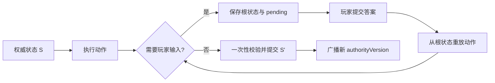

# SkillCode 作者标准与现役 Helper 接口手册

> 状态：现役实现说明（RED-137）
> 适用范围：当前仓库内受信任的技能、卡牌、规则和延迟效果代码
> 依据：以本仓库运行时代码和兼容审计脚本为准；文档与实现冲突时应停止导入并修正文档或实现

> ABI v1：未来受限 Runtime 的冻结边界见 [`SKILLCODE_ABI_V1.md`](./SKILLCODE_ABI_V1.md) 与
> [`SKILLCODE_THREAT_MODEL.md`](./SKILLCODE_THREAT_MODEL.md)。现役运行时仍不是安全沙箱；本手册中的
> 宿主 helper 对象不得直接穿越 ABI v1 边界。

## 1. 先记住两件事

第一，当前的 SkillCode 是“项目内部脚本”，不是安全沙箱。它最终会由 JavaScript 动态编译执行，因此只能运行随项目审查、测试并发布的受信任代码。来自社区服务器、关卡包或玩家文件的代码，在 RED-135 的沙箱和权限模型落地前不得直接执行。现有 Content Pipeline 会拒绝含可执行代码字段的外部内容，这是有意的安全边界。

第二，一次玩家操作不是“脚本运行到一半停住，之后接着运行”。需要选目标或选项时，服务端会保留权威起点和已经收集的答案；收到答案后，从动作根部重新执行整次操作。脚本必须是确定性的，也不能依赖闭包、系统时间或执行次数。



通俗地说：把 SkillCode 写成一个“给定同一状态和同一答案，永远算出同一结果”的纯流程。不要把关键进度藏在局部变量、计时器或外部对象里。

## 2. 六种代码入口不是同一种环境

| 入口 | 常见位置 | 主要用途 | 能否交互 | 特别限制 |
| --- | --- | --- | --- | --- |
| 技能 `code` | `data/skills/*.json` | 主动技能和单位能力 | 可以选目标、选项 | 最完整的 Helper 环境 |
| 卡牌 `code` | `data/cards/*.json` | 手牌效果 | 可以选目标、选项 | 没有保证存在的 `sourcePiece` |
| 规则 `skillCode` | `data/rules/*.json` | 规则附带的主动能力 | 只可选选项 | 现役 wrapper 不注入 `selectTarget`；状态 Helper 的细节与技能入口不同 |
| 规则 `triggerSkill` | 规则触发器 | 响应事件 | 当前应视为不可交互 | 选择、传送、范围查询能力受限 |
| `pendingEffectCode` | 延迟目标效果 | 选定目标后执行小段效果 | 不可再次发起选择 | 只有序列化 `ctx`，没有外层 Helper 闭包 |
| `previewCode` | 技能预览 | UI 展示冷却、伤害等预估 | 不可以 | 不是权威规则，不能改变战局 |

现役入口形式也不同：技能 `code` 定义 `function executeSkill(context)`；卡牌 `code` 定义 `function executeCard(context)`；规则 `skillCode` 是由运行时包装的内联语句；规则 `triggerSkill` 引用一个经触发器适配器执行的技能 ID；pending 的 `effectCode` 定义 `function(ctx)`；预览定义 `function calculatePreview(piece, skillDef, currentCooldown)`。

不要把一段代码从一个入口直接复制到另一个入口。先核对该入口的绑定和事件语义。

ABI v1 不把这些输入当作开放对象：每个入口的字段由 `SKILLCODE_ABI_V1_INPUT_SCHEMAS` 单独冻结，context、
battle、trigger、pending、piece 与 skill 均使用带 `schemaVersion` 和 `revision` 的只读 JSON snapshot；pending
payload 也有独立版本包络。snapshot 的 `data` 字段由 `SKILLCODE_ABI_V1_DATA_SCHEMAS` 精确冻结；pending payload
只允许 `handles`、`numbers`、`enums` 三类 typed record。内容代码不得伪造版本、保存宿主对象或把一个入口的
snapshot 当作另一个入口使用。

## 3. 推荐的编写顺序

1. 先用自然语言写清楚输入、目标、资源消耗、伤害或状态、取消行为。
2. 在 JSON 的 `targeting.steps` 中声明所有选项和目标，顺序必须与代码中的 `selectOption`、`selectTarget` 调用一致。
3. 只使用本手册列出的 Helper 改变战局，不直接修改生命、位置、手牌或规则数组。
4. 为取消、空目标、死亡目标、重复状态和手牌已满写明确分支。
5. 运行兼容审计，再用固定种子回放正常、取消、重连和重复提交路径。

一个典型的技能定义骨架如下：

```json
{
  "id": "example-skill",
  "name": "示例技能",
  "description": "选择模式和目标后结算效果。",
  "kind": "active",
  "type": "normal",
  "cooldownTurns": 2,
  "maxCharges": 0,
  "powerMultiplier": 1,
  "actionPointCost": 1,
  "range": 3,
  "targetType": "piece",
  "filter": "all",
  "targeting": {
    "steps": [
      {
        "kind": "option",
        "title": "选择模式",
        "options": [
          { "label": "攻击", "value": "attack" },
          { "label": "治疗", "value": "heal" }
        ]
      },
      {
        "kind": "target",
        "type": "piece",
        "range": 3,
        "filter": "all"
      }
    ]
  },
  "code": "function executeSkill(context) { /* 见下文 */ }"
}
```

### `targeting.steps` 常用字段

| 字段 | 含义 |
| --- | --- |
| `kind` | `option` 或 `target`；目标步骤再用 `type` 声明 `piece`、`grid` 或 `cell` |
| `range` / `minRange` | 最大、最小距离 |
| `distanceMetric` | `manhattan` 或 `chebyshev` |
| `filter` | 声明层支持 `enemy`、`ally`、`all`、`self`；代码中的 `selectTarget` 使用 `enemy`、`ally` 或 `all` |
| `requireWalkable` | 网格是否必须可行走 |
| `requireUnoccupied` / `allowSourceOccupant` | 网格占用要求及是否允许施法者占据 |
| `sameRowOrColumn` | 是否限制与来源同一行或同一列 |
| `requiredTargetStatuses` / `forbiddenTargetStatuses` | 目标必须具备或不得具备的状态 |
| `projectile` | 是否按投射物路径验证 |

复杂目标还可能声明扩展格、方向和多选数量。不要只在代码里临时加一套 UI 不知道的目标规则；声明式步骤负责告诉客户端和服务端“接下来允许选什么”，代码负责结算。

## 4. 各入口可依赖的上下文

### 4.1 技能 `code`

技能入口通常可访问：

- `context`：本次技能的上下文；
- `sourcePiece`：权威 `battle.pieces` 中的施法者对象；
- `battle`：当前战斗状态；
- `selectTarget`、`selectOption`、`select`；
- `dealDamage`、`healDamage`、`teleport`、`traceProjectile`；
- 状态、规则、玩家规则、技能、卡牌和手牌 Helper；
- `calculateDistance`、范围查询和 `fireEvent`；
- 受控的 `Math`、`Date` 以及 `console`。

`context` 中常用字段包括 `piece`、`target`、`targetPosition`、`selectedOption`、`targets`、`battle` 和技能定义。连续调用多次 `selectTarget` 时，运行时通过调用序号读取 `context.targets` 中对应答案，因此调用顺序必须稳定。

### 4.2 卡牌 `code`

卡牌入口通常可访问 `context`、`battle`、`playerId`、目标和选项选择、伤害与治疗、手牌、状态、单位规则和玩家规则 Helper。卡牌不保证存在 `sourcePiece`；需要单位时必须明确选择或从 `context` 中读取已声明的目标。

### 4.3 规则 `skillCode`

这是规则提供的主动技能，可使用 `selectOption`、伤害、治疗、状态、规则、玩家规则、技能和事件 Helper；现役
wrapper 不注入 `selectTarget`，需要目标选择时必须另建运行时扩展，不能假定技能入口的选择能力可复用。它的
状态添加/移除细节与普通技能并不完全相同，见“状态与规则”一节。

### 4.4 规则 `triggerSkill`

`triggerSkill` 用于响应 `beforeDamageTaken`、`afterSkillUsed` 等事件。当前实现会把触发事件上下文适配成可修改对象，但选择和空间能力不完整：`selectTarget` 返回空，传送失败，范围查询也不能作为可靠能力；它也不保证注入 `selectOption`、`fireEvent` 或 `traceProjectile`。

因此现阶段的安全规则是：触发技能只能做不需要玩家输入、目标已由事件给出的同步结算。需要交互时改用权威 pending 流程或创建运行时扩展任务，不要在触发器里模拟弹窗。

### 4.5 `pendingEffectCode`

延迟效果接收一个 `ctx`，当前稳定字段是：

- `ctx.battle`；
- `ctx.playerId`；
- `ctx.targetPiece`；
- `ctx.targetX`、`ctx.targetY`；
- `ctx.pending`，其中包含已选目标等 pending 数据；
- `ctx.payload`。

这段代码被单独编译，没有创建 pending 时的局部变量和 Helper 闭包。现役 trusted runtime 只应把 JSON 可序列化
的 ID、坐标、数值和枚举放入 payload；不要放单位对象、函数或 Map。ABI v1 更严格：adapter 必须把这些值归类到
`handles`、`numbers`、`enums` typed records，不能原样传递开放对象。

### 4.6 `previewCode`

预览入口只服务于显示，可读取单位、技能定义、当前冷却和距离计算等有限信息。它不是权威结算，错误时会退回静态显示。不要在这里改状态，也不要用随机数决定正式数值；最终伤害、治疗和冷却必须由权威技能代码计算。

## 5. 选择与 pending

### 5.1 `selectTarget(options)`

常用参数：

```js
const selected = selectTarget({
  type: 'piece',       // 或 'grid'
  range: 4,
  filter: 'enemy'
});

if (selected?.needsTargetSelection) return selected;
if (!selected) return { success: false, message: '没有合法目标' };
```

当答案已经存在时，它返回权威单位或坐标；缺少答案时，它返回一个“需要选择”的结果。必须立即 `return` 这个结果，让服务端建立 pending。不要在返回 pending 后继续扣资源、制造伤害或修改状态。

默认值会随入口而变化，普通技能中的常见默认是单位目标、距离 5、敌方过滤。正式内容应显式写出类型、范围和过滤条件，避免运行时升级改变含义。

连续选择多个目标时，按稳定顺序调用多次：

```js
const first = selectTarget({ type: 'piece', range: 3, filter: 'enemy' });
if (first?.needsTargetSelection) return first;

const second = selectTarget({ type: 'piece', range: 3, filter: 'enemy' });
if (second?.needsTargetSelection) return second;
```

不要根据尚未权威确定的随机数、系统时间或客户端状态决定“这次是否调用第二次”，否则重放时调用序号会错位。

### 5.2 `selectOption(options)`

```js
const mode = selectOption({
  title: '选择释放方式',
  options: [
    { label: '原地释放', value: 'stay', description: '不移动' },
    { label: '传送后释放', value: 'teleport', description: '移动到目标附近' }
  ],
  playerId: sourcePiece.ownerPlayerId,
  canCancel: true,
  cancelValue: 'cancel'
});

if (mode?.needsOptionSelection) return mode;
if (mode === 'cancel') return { success: false, message: '已取消' };
```

选项的 `value` 必须是稳定、可序列化的值。选项文案可以调整，业务分支不要依赖显示文本。运行时也支持手牌多选及 `minSelections`、`maxSelections` 等约束，具体声明必须和 `targeting.steps` 对齐。

### 5.3 `select(...)`

`select` 是部分旧内容使用的通用选择接口。新增内容优先使用语义更明确的 `selectTarget` 和 `selectOption`；如果维护旧内容，先查兼容矩阵与现有调用，不要凭名称猜测返回结构。

### 5.4 取消与资源消耗

完整动作只有最终成功提交时才结算技能成本。pending 期间保存的是权威根状态，回答后会重放。默认的旧式“后置效果取消”可能只跳过后置效果并提交根动作；声明 `rollbackPendingTargetOnCancel` 的路径会回滚整个动作。作者必须在设计中明确采用哪一种，不要依赖默认值猜测。

每个答案还必须匹配服务端当前 pending 的动作、consumer/cursor、输入所有者和 `authorityVersion`。旧弹窗、重复答案、回合已经推进或版本不一致都会被视为 stale/conflict 并拒绝；客户端此时应拉取并采用服务端权威状态，不能继续套用本地旧状态。合法的重复提交也不能让同一效果结算两次。

## 6. 伤害与治疗

### 6.1 `dealDamage(source, targets, amount, type, options?)`

目标可以是单个单位或数组；伤害类型包括 `physical`、`magical`、`true` 和 `toxin`。应让 Helper 完成完整管线，不要直接写 `target.currentHp -= amount`。

伤害管线的核心顺序是：

1. 校验来源、目标和数值；
2. 批次级 `beforeDamageDealt`；
3. 每个目标的 `beforeDamageTaken`；
4. 防御、最低伤害及伤害类型处理；
5. `beforeDamageShield`、`beforeDamageApplied`；
6. 统一提交生命值变化；
7. 派发后置事件、死亡/复活/墓地/充能等生命周期；
8. 按 FIFO 处理 `damageQueue` 中的反伤或连锁伤害。

嵌套触发器里不要再次直接调用 `dealDamage`。运行时会以 `RVB_DAMAGE_REENTRANT_CALL` 拒绝重入；反伤、溅射和后续伤害应排入 `damageQueue`，从而保留确定顺序并受深度、批次数预算保护。

```js
const result = dealDamage(sourcePiece, target, 4, 'physical');
if (result?.pending) return result;
```

运行时目前限制事件链深度 20、单链派发预算 100。不要用循环触发器绕过限制。

### 6.2 `healDamage(source, targets, amount, options?)`

单目标治疗会依次经过 `beforeHealDealt`、`beforeHealTaken`、实际治疗和后置事件，同样不应直接修改生命值。

当前实现的多目标治疗存在一个需要作者知道的兼容细节：数组入口会先派发一次批次级 `beforeHealDealt`，随后递归处理每个目标时又分别派发该事件。也就是说，它不是“全批次严格只触发一次”。在运行时统一前，不要编写依赖该事件精确一次的群体治疗规则；使用固定种子回放验证具体触发次数，并把新规则写入独立修复任务。

### 6.3 “同时”语义白名单（未来合同，尚未全部实现）

项目已决定：只有 **Damage、Heal、Summon、Death** 四类效果可以定义批次式“同时”语义。这里的“同时”不是多线程并发，而是同一批次先校验并准备所有目标，统一提交该批次的主状态变化，再按稳定顺序串行处理事件与后续效果。Queue 只负责确定性调度和连锁，不能单独提供同时语义。

当前只有 Damage 已具备正式 `DamageBatch` 与 `damageQueue` 合同。Heal 仍存在上一节所述的递归兼容行为，现役 context **没有** `healQueue`；Summon 和 Death 也没有向 SkillCode 作者公开可直接写入的批次队列。相关运行时设计与迁移由 [RED-139](https://linear.app/redvsblue/issue/RED-139/建立四类确定性-effectbatchqueue-并冻结同时语义白名单) 跟踪，在该任务完成并更新本手册前，不得在内容代码中使用或模拟 `healQueue`、`summonQueue`、`deathQueue` 或无类型 `effectQueue`。

移动、传送、状态、驱散、资源、手牌、技能替换、地格和投射物等其他效果只允许按明确顺序逐项结算。内容作者不得借用上述四类队列包装其他副作用，也不得把数组遍历或 Queue 描述成同时提交。

## 7. 空间与特殊移除

### 7.1 `teleport(x, y)` / `teleport({ x, y })`

传送作用于当前技能的 `sourcePiece`，会验证地图范围、地块是否可行走以及目标格是否被占用。显式提供经过选择或算法验证的坐标；无参数调用当前会使用默认目标或确定性随机空格作为兼容回退，新增内容不应依赖这个隐式行为。

### 7.2 `traceProjectile(origin, direction, options?)`

投射物追踪按正交单位方向扫描，可配置 `excludePieceId` 和 `maxDistance`。它返回有序的格子、单位、地形或边界事实，但不会替你决定命中效果和停止规则。作者负责根据返回序列结算，伤害仍应走 `dealDamage`。

### 7.3 `context.forceRemoveEnemyPieceById(id)`

这只在明确需要“强制移出战场”时使用：目标必须是存活敌方单位。它会从战场移除目标并记录动作，但刻意绕过伤害、防护、死亡、复活、墓地和充能流程。普通击杀、处决或生命归零不能用它代替伤害管线。

## 8. 状态、规则、技能与手牌

### 8.1 状态 Helper 的入口差异

现役入口还没有完全统一状态语义：

下表也由 ABI v1 的 `statusSemantics` 机器字段冻结；状态对象仅可使用
`SKILLCODE_ABI_V1_STATUS_FIELDS` 中的 canonical 字段，新增临时字段必须先变更合同。ABI 机器字段将单位与玩家
状态事件和默认值分开；玩家状态 helper 不派发单位状态的 apply/remove 事件。规则 `skillCode` 仅单位状态缺失
duration/uses 时按 `-1` 规范化，玩家状态保持现值。

| 入口 | 添加同 ID 状态 | `afterStatusApplied` | 移除后的事件/关联规则清理 |
| --- | --- | --- | --- |
| 技能 `code` | 追加状态 | 会派发 | 派发移除事件；在没有同标签状态时清关联规则 |
| 卡牌 `code` | 追加并应用卡牌强度修正 | 当前不保证派发 | 当前不保证派发移除事件 |
| 规则 `skillCode` | 替换同 ID 状态，持续/次数缺省为 `-1` | 当前不保证派发 | 会派发移除事件；不等同于技能入口的完整清理 |
| 规则 `triggerSkill` | 追加状态 | 当前不保证派发 | 会派发移除事件 |

安全写法：

- 明确传入状态 ID、持续时间、次数和标签；
- 添加前检查是否允许叠加；
- 依赖“应用后事件”或关联规则清理时，为所用入口写回归测试；
- 不要直接 `piece.statuses.push(...)` 或手工 splice。

### 8.2 规则与玩家规则

单位规则和玩家规则有各自的添加、移除和查询 Helper。玩家规则通常会阻止重复 ID，而部分单位规则入口会直接追加。若规则设计上唯一，应先查询再添加；不要假定所有入口自动去重。

### 8.3 技能 Helper

使用添加、移除、替换或查询技能的 Helper 修改单位能力。不要直接改 `piece.skills`，否则可能绕过来源追踪、冷却初始化或相关日志。

### 8.4 手牌 Helper

`addCardToHand(cardId, targetPlayerId?)` 会经过前后事件、生成确定性的实例 ID，并执行手牌上限。当前上限为 10；溢出的卡会进入弃牌记录并写日志。`discardCard(instanceId)` 按实例 ID 查找手牌，不能只传卡牌定义 ID。

复制、偷取或赠送卡牌时，接收者必须显式传入。比如“给对方复制一张诅咒”应把对手 ID 传给 `addCardToHand`，不能复用施法者的 `playerId`：

```js
const opponentId = battle.players.find(p => p.playerId !== playerId)?.playerId;
if (!opponentId) return { success: false, message: '找不到对手' };
addCardToHand('curse-card', opponentId);
```

pending payload 只能保存卡牌 ID、实例 ID等可序列化标识，不能保存 `getHand()` 返回的对象引用。

### 8.5 技能入口 Helper 速查

下表是普通技能 `code` 的现役调用形式。其他入口可能只提供其中一部分，必须结合第 4 节与兼容审计确认。

| Helper | 调用形式 | 返回/处理关系 |
| --- | --- | --- |
| `selectTarget` | `selectTarget({ type, range?, filter? })` | 返回单位/坐标，或 `needsTargetSelection` |
| `selectOption` | `selectOption({ title?, options, playerId?, canCancel?, cancelValue?, selectionMode?, presentation?, minSelections?, maxSelections? })` | 返回选中值，或 `needsOptionSelection` |
| `teleport` | `teleport(x, y)` / `teleport({ x, y })` | 移动当前 `sourcePiece`，返回含 `success` 的结果 |
| `dealDamage` | `dealDamage(attacker, targetOrTargets, amount, type?, battle?, skillId?, skipBefore?, killerPlayerId?)` | 进入完整伤害批次和生命周期 |
| `healDamage` | `healDamage(healer, targetOrTargets, amount, battle?, skillId?)` | 进入治疗事件管线 |
| `traceProjectile` | `traceProjectile(origin, direction, { excludePieceId?, maxDistance? })` | 返回有序路径事实，不自动造成伤害 |
| `addStatusEffectById` | `addStatusEffectById(pieceId, statusObject)` | 给单位添加状态；入口语义见 8.1 |
| `removeStatusEffectById` | `removeStatusEffectById(pieceId, statusId)` | 按状态 ID 移除 |
| `addRuleById` / `removeRuleById` | `(pieceId, ruleId)` | 加载或移除单位规则 |
| `addSkillById` / `removeSkillById` | `(pieceId, skillId)` | 添加/移除单位技能，添加时初始化冷却 |
| `addCardToHand` | `addCardToHand(cardId, targetPlayerId?)` | 走手牌事件、上限和弃牌逻辑 |
| `discardCard` | `discardCard(cardInstanceId)` | 按实例 ID 移入弃牌堆 |
| `getHand` | `getHand(targetPlayerId?)` | 返回当前手牌数组；不要跨 pending 保存引用 |
| `getAllEnemiesInRange` / `getAllAlliesInRange` | `(range)` | 以当前技能上下文查询单位摘要 |
| `calculateDistance` | `calculateDistance(x1, y1, x2, y2)` | 返回两点的曼哈顿距离 |
| `isTargetInRange` | `isTargetInRange(target, range)` | 以当前来源判断范围 |
| `fireEvent` | `fireEvent(eventName, context)` | 进入统一触发器链和预算 |

玩家级 Helper 使用相同的“目标玩家 ID 在前”约定：

| Helper | 调用形式 | 要点 |
| --- | --- | --- |
| `addPlayerRuleById` / `removePlayerRuleById` | `(playerId, ruleId)` | 添加会阻止同 ID 重复 |
| `addPlayerSkillById` / `removePlayerSkillById` | `(playerId, skillId)` | 添加会初始化 `currentCooldown: 0` 并阻止重复 |
| `addPlayerStatusEffectById` | `(playerId, statusObject)` | 追加玩家状态，不等同于单位状态事件语义 |
| `removePlayerStatusEffectById` | `(playerId, statusId)` | 按 ID 移除玩家状态 |

`Math`、`Date` 和 `console` 也是注入绑定；前两者必须使用运行时提供的版本，`console` 只用于有上下文的诊断，不能承担状态或流程控制。

## 9. 事件、触发顺序与原子性

`fireEvent(name, context)` 用于显式派发规则事件。当前稳定的同一事件触发顺序是：

1. 全局规则；
2. 单位规则；
3. 玩家规则；
4. 响应式卡牌。

每组内按优先级从高到低执行，相同优先级保留稳定快照顺序。事件触发过程中如果建立 pending，运行时会保存剩余触发器并在重放时恢复；异常时会恢复触发次数等限制，避免半次结算污染状态。

不要通过遍历底层数组自己模拟触发器顺序，也不要假设后加入的规则必然先执行。需要顺序时使用显式优先级并写测试。

## 10. 确定性、缓存与安全边界

### 10.1 随机数和时间

SkillCode 中注入的 `Math` 和 `Date` 受规则运行时控制。只能使用注入对象，不要通过 `globalThis`、动态导入或宿主 API 取得系统随机数和真实时间。相同初始状态、随机种子与命令序列必须得到同一结果。

所有现役入口都按同步流程编写：不要使用 `async`、`await`、Promise、`setTimeout` 或后台任务。脚本返回时，本次结果必须已经确定；否则事务无法知道何时提交或回滚。

`previewCode` 属于显示层，当前并不具备与权威结算完全相同的随机和时间约束，所以它更不应承担规则判断。

### 10.2 编译缓存

运行时会按引擎版本、入口类型、内容 ID、内容版本/修订和代码哈希缓存已编译函数，并保留原始源码作为碰撞保护。内容修改时应同步更新内容版本或修订信息；不要依赖旧函数对象或把编译结果暴露到游戏状态中。

### 10.3 当前不是沙箱

禁止在现役内容中尝试访问：

- 文件系统、网络、进程、环境变量；
- DOM、`globalThis`、`window`、Node 的 `process`、`require` 或动态 `import`；
- `eval`、`Function` 或自行构建的新执行环境；
- 原型链修改、无限循环、超大内存分配；
- 客户端私有状态作为权威结果来源。

这些规则既是安全要求，也是未来迁移到 RED-135 受限 Runtime 的兼容要求。外部包即使由玩家主动下载，也必须先通过清单、版本、权限、签名/来源提示和沙箱预算校验，不能因为“自愿下载”就获得宿主机权限。

## 11. 推荐范例

### 11.1 单目标主动技能

```js
const target = selectTarget({ type: 'piece', range: 3, filter: 'enemy' });
if (target?.needsTargetSelection) return target;
if (!target || target.currentHp <= 0) {
  return { success: false, message: '目标已失效' };
}

dealDamage(sourcePiece, target, 4, 'magical');
return { success: true, message: `${sourcePiece.name}造成了4点魔法伤害` };
```

### 11.2 先选模式，再选目标

```js
const mode = selectOption({
  title: '选择效果',
  options: [
    { label: '平静', value: 'calm' },
    { label: '暴怒', value: 'rage' }
  ],
  canCancel: true,
  cancelValue: 'cancel'
});
if (mode?.needsOptionSelection) return mode;
if (mode === 'cancel') return { success: false, message: '已取消' };

const target = selectTarget({ type: 'piece', range: 2, filter: 'ally' });
if (target?.needsTargetSelection) return target;
if (!target) return { success: false, message: '目标不存在' };

if (mode === 'calm') {
  addStatusEffectById(target.instanceId, {
    id: 'calm', type: 'calm', currentDuration: 1, currentUses: -1
  });
} else {
  addStatusEffectById(target.instanceId, {
    id: 'rage', type: 'rage', currentDuration: 1, currentUses: -1
  });
}
return { success: true };
```

对应的 `targeting.steps` 必须同样先声明 option，再声明 piece。

### 11.3 触发器中的反伤

下面是意图示例，实际字段以事件上下文契约为准：

```js
if (context.damage > 0 && context.sourcePiece) {
  context.damageQueue.push({
    attacker: context.piece,
    target: context.targetPiece,
    damage: 1,
    damageType: 'true',
    skillId: 'example-reflect'
  });
}
```

关键点是加入队列，而不是在伤害触发器里重入 `dealDamage`。

### 11.4 卡牌添加状态

```js
const target = selectTarget({ type: 'piece', range: 5, filter: 'ally' });
if (target?.needsTargetSelection) return target;
if (!target) return { success: false, message: '没有合法友军' };

addStatusEffectById(target.instanceId, {
  id: 'blessing', type: 'blessing', currentDuration: 2, currentUses: -1
});
return { success: true, message: `${target.name}获得祝福` };
```

若规则依赖 `afterStatusApplied`，不要直接假定卡牌入口会派发；应使用与当前入口匹配的测试或把统一语义列为运行时任务。

### 11.5 `pendingEffectCode`

```js
function (ctx) {
  if (!Number.isInteger(ctx.targetX) || !Number.isInteger(ctx.targetY)) return;
  ctx.battle.extensions = ctx.battle.extensions || {};
  ctx.battle.extensions.exampleMarkers = ctx.battle.extensions.exampleMarkers || [];
  ctx.battle.extensions.exampleMarkers.push({
    x: ctx.targetX,
    y: ctx.targetY,
    ownerPlayerId: ctx.playerId,
    markerType: ctx.payload && ctx.payload.markerType
  });
}
```

这里只展示现役 trusted runtime 的序列化边界和普通扩展数据，不是 ABI v1 payload 形状；ABI adapter 中的同一
`markerType` 应读取 `payload.enums.markerType`。由于 `pendingEffectCode` 当前没有完整状态 Helper，若效果要求伤害、
治疗或状态生命周期，优先把结算放回主技能的权威重放流程，不要在这里直接修改生命或状态数组。

### 11.6 `previewCode`

```js
function calculatePreview(piece, skillDef, currentCooldown) {
  return {
    description: skillDef.description,
    expectedValues: { damage: Math.max(0, piece.attack) },
    currentCooldown: currentCooldown
  };
}
```

预览只返回显示信息，不改变战斗对象。

## 12. 禁止做法与替代方案

| 禁止做法 | 会造成什么问题 | 使用什么替代 |
| --- | --- | --- |
| 直接修改 `currentHp` | 绕过护盾、免疫、死亡、复活、日志 | `dealDamage` / `healDamage` |
| 直接修改 `x`、`y` | 绕过地图、占用和空间校验 | `teleport` 或权威移动命令 |
| 直接 push/splice 手牌 | 无实例 ID、上限、弃牌和事件 | 手牌 Helper |
| 直接 push/splice 规则或技能 | 无去重、来源、事件或冷却初始化 | 对应 Helper |
| 在触发器中嵌套 `dealDamage` | 伤害重入、顺序不确定 | `damageQueue` |
| pending 保存对象或函数 | 无法序列化，重连/重放失效 | 只保存 ID、坐标、数值、枚举 |
| 依赖闭包记住“执行到哪” | 回答后从根部重放，状态丢失 | 权威 pending 答案和 payload |
| 使用真实时间或宿主随机 | 双端结果不一致 | 注入的确定性 `Math` / `Date` |
| 在 `previewCode` 结算规则 | UI 与服务端分叉 | 正式 code 权威计算 |
| 运行未审查的外部代码 | 当前无安全沙箱 | 等待 RED-135 Runtime/权限体系 |

## 13. 提交前验证清单

- [ ] 代码入口与使用的 Helper 匹配；
- [ ] `targeting.steps` 与选择调用顺序一致；
- [ ] 正常、取消、目标失效、重连和重复提交都有预期；
- [ ] 没有直接修改生命、位置、手牌、规则或技能数组；
- [ ] 所有 pending 数据都可 JSON 序列化；
- [ ] 没有系统时间、宿主随机、文件、网络或进程访问；
- [ ] 伤害/治疗/状态触发次数有回归测试；
- [ ] 相同种子和命令序列的回放结果一致；
- [ ] 运行 `node scripts/audit-skillcode-compat.mjs`；
- [ ] 运行项目约定的编码、类型和相关测试。

调试 pending 时，至少记录回合、阶段、玩家、动作 ID、随机种子、consumer/cursor、authorityVersion、提交前后状态摘要和拒绝原因。只看到客户端弹窗不代表服务端已经接受答案。

## 14. 与 RED-135 的关系

本手册记录“现在能做什么”。RED-135 将把内容编辑器、可导入的 SkillCode、受限 Runtime、权限清单、预算和兼容版本合并成可视化内容生产体系。迁移原则是：

1. 现役 Helper 名称和语义形成有版本的 ABI；
2. 外部内容只能调用白名单能力；
3. 执行时间、事件次数、内存和 pending 深度都有预算；
4. 导入时静态审计，运行时再次隔离；
5. 开发者内容与玩家内容使用同一功能模型，但权限来源和信任提示必须可见。

## 15. 实现依据

ABI v1 的机器可读 capability、预算、输入输出与稳定错误码位于
[`lib/game/skillcode-runtime/abi-v1.ts`](../../lib/game/skillcode-runtime/abi-v1.ts)。它目前未接入生产执行器；作者不得因为 ABI 文件存在，就将外部
SkillCode 放入 Content Pipeline 或声称现役 `eval` 路径具备沙箱隔离。

本文基于以下现役源码和技术合同整理：

- [`lib/game/dynamic-code-runtime.ts`](../../lib/game/dynamic-code-runtime.ts)
- [`lib/game/skills.ts`](../../lib/game/skills.ts)
- [`lib/game/triggers.ts`](../../lib/game/triggers.ts)
- [`lib/game/turn.ts`](../../lib/game/turn.ts)
- [`lib/game/targeting.ts`](../../lib/game/targeting.ts)
- [`lib/game/spatial.ts`](../../lib/game/spatial.ts)
- [`lib/game/rule-loader.ts`](../../lib/game/rule-loader.ts)
- [`scripts/audit-skillcode-compat.mjs`](../../scripts/audit-skillcode-compat.mjs)
- [`DYNAMIC_CODE_RUNTIME.md`](./DYNAMIC_CODE_RUNTIME.md)
- [`SKILLCODE_COMPATIBILITY_MATRIX.md`](./SKILLCODE_COMPATIBILITY_MATRIX.md)
- [`DAMAGE_PIPELINE.md`](./DAMAGE_PIPELINE.md)
- [`COMBAT_TRIGGER_ATOMICITY_CONTRACT.md`](./COMBAT_TRIGGER_ATOMICITY_CONTRACT.md)
- ADR-0004、ADR-0006、ADR-0010、ADR-0015、ADR-0017

每次 Runtime 或 Helper 语义变化，都必须在同一个 PR 中更新本手册和兼容矩阵。
